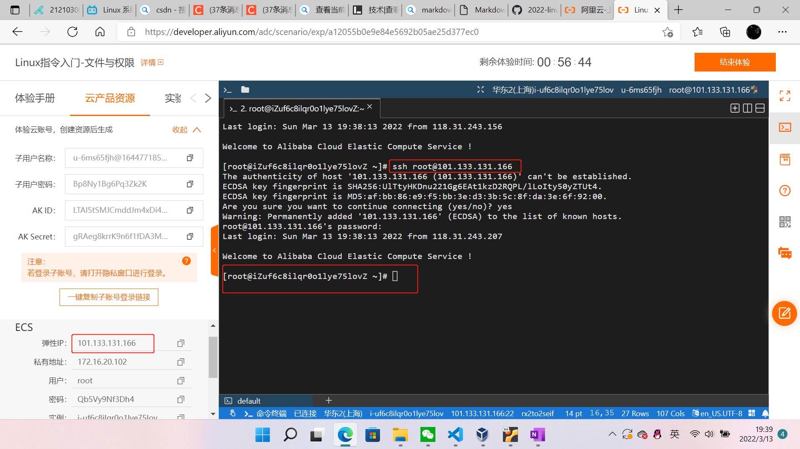

# Linux 实验一

### 实验环境

- VirtualBox
- Ubuntu 20.04 Server 64bit
- 阿里云平台
  
## 实验问题

### 一.调查并记录实验环境的如下信息：

**1.当前Linux发行版基本信息**

（1）虚拟机Ubuntu环境

- `lsb_release -a`


- `cat /etc/issue`


- `cat /etc/os-release`
  


以上三种方法都可以看到，当前Ubuntu的发行版为20.04

（2）阿里云CentOS环境

登陆阿里云



- `lsb_release -a`


- `cat /etc/issue`


- `cat /etc/os-release`
  


以上方法可看到阿里云远程机的发行版本为：CentOs 7.7.1908
  

**2.当前Linux内核版本信息**

- `uname -a`


- Ubuntu的内核版本：5.4.0
- 阿里云远程机的内核版本：3.10.0

### 二.Virtualbox安装完Ubuntu之后添加的网卡如何实现系统开机自动启用和自动获取IP？

阿里云的CentOs环境没有目录，所以网卡的实验只在Ubuntu中做

> 我最开始以为我没有配置网卡，然后进行了如下操作，

- 查看目录：

`ls /etc/netplan/`


- 首先输入命令：
```
sudo vim /etc/netplan/00-installer-config.yaml
```


- 保存并退出，先按"Esc"，再按"shitf+zz"
- 再输入以下命令，应用网卡：
```
sudo netplan apply
```


就可以了。

但是实际上，我在导入Ubuntu20.04的时候其实已经配置过网卡了，经过老师的指导，两张网卡的作用分别为：

> enp0s3 对应的是 NAT 网卡，这是用来让虚拟机可以上网的，不是用来 SSH 连接的
> 
> enp0s8 对应的是 Host-only 网卡，这是用来 SSH 连接到虚拟机的


- 输入命令：
```
ip a
```
看到如下信息，就是说我在导入Ubuntu的时候已经配置好两张网卡了


### 三.如何使用scp[虚拟机和宿主机之间]、[本机和远程Linux系统之间]传输文件？

**1.[本机和远程Linux系统之间]传输文件**

- 首先，在阿里云环境创建一个文件`test`,输入内容`hello,linux`

```
touch test
echo "hleeo,linux" > test
```
  


- 其次，在本地`gitbash`中输入以下命令：
  
```
scp root@47.103.86.242:/root/test ./
```

> 其中，`47.103.86.242`为阿里云环境的弹性IP

- 最后输入阿里云环境的密码，就成功了


**2.scp[虚拟机和宿主机之间]传输文件**

> 准备工作（很关键）

- 首先，为Ubuntu安装ssh
  
```
sudo apt-get install openssh-server
```


- 然后，检查openssh-server运行状态,看看ssh是否配置成功

```
sudo ps -e | grep ssh
```


  
> 开始传输文件

- 将文件夹从虚拟机传输到本地
  
  - 首先在虚拟机中创建一个文件夹`first-dir`,使用如下命令：

  ```
  mkdir first-dir
  ```

  - 再cd到 `first-dir` 的目录，使用 `touch` 命令，创建三个文件`one`,`two`,`three`,使用`pwd`命令查看他们的路径
  


  - 在本地`git-bash`中输入如下命令,就可以传输成功

  ```
  scp -r cuc@192.168.56.101:/home/cuc first-dir
  ```

> 其中，`cuc@192.168.56.101:/home/cuc`是虚拟机的路径，`first-dir`是在虚拟机创建的文件夹的名称


- 将文件从本地传输到虚拟机
  - 首先在本地创建一个文件`linux.txt`,在里面写入一些内容
  
  - 然后在git-bash中输入以下命令：
  
  ```
  scp C:/Users/86183/Desktop/linux.txt cuc@192.168.56.101:/home/cuc/
  ```
  > 其中，`C:/Users/86183/Desktop/linux.txt`是本地文件的路径，`cuc@192.168.56.101:/home/cuc/`是虚拟机要接收文件的路径

  - 最后，在虚拟机中验证，通过`ls`命令看到虚拟机中已经有文件`linux.txt`
  
  - 使用命令`cat linux.txt`，就可以看到文件中的内容，不过标点符号被识别为乱码


### 四.如何配置SSH免密登录？

- 首先，在本地git-bash生成公私钥对，输入如下命令：

  ```
  ssh-keygen -t rsa
  ```

我在克隆仓库的时候已经在github网站上配置了ssh的公钥，所以这里不再覆盖。


- 然后，将主机的公钥传到虚拟机中，输入如下命令：
  
  ```
  ssh-copy-id cuc@196.168.56.101
  ```


- 最后，验证免密登陆，输入如下命令：
  
  ```
  ssh cuc@196.168.56.101
  ```

可以看到，最开始ssh连接的时候需要输入虚拟机cuc的密码，配置免密登陆后不用再输入密码就可以连接，所以已经成功了。


### 五.遇到的错误

1. 在操作第二步的时候，以为要添加网卡3，配置网卡时太啰嗦，徒增麻烦
   
- 错误原因：由于乱七八糟的配了一大堆，把原来的配置都弄乱了，以至于找不到Ubuntu的IP地址，不能从本地ssh连接，
  
- 解决方式：删了网卡3，并且虚拟机恢复备份之后重新来了一遍。

2. 本地与虚拟机之间scp文件时总是失败
   
- 错误原因：输入路径时空格和"/"的使用方式不对
  
- 正确的命令：
  
  ```
  scp -r cuc@192.168.56.101:/home/cuc first-dir
  ```

- 我输入的错误命令：
  
  ```
  scp -r cuc@192.168.56.101:/home/cuc/first-dir
  ```

- 错误点：从虚拟机拷贝文件到本地的时候，虚拟机的路径后面应该是空格，而不是"/"

3. 本地与虚拟机之间传输文件总是无法连接

- 错误原因：没有用ssh将本地git-bash和虚拟机Ubuntu连接起来

- 解决方式：首先为Ubuntu安装ssh，然后在本地git-bash环境通过ssh命令连接Ubuntu
  
  ```
  ssh cuc@196.168.56.101
  ```
  
# 参考资料
[查看版本信息](https://blog.csdn.net/qq_31278903/article/details/83146031?spm=1001.2014.3001.5506)

[查看网卡](https://blog.csdn.net/xiongyangg/article/details/110206220)

[添加网卡](https://blog.csdn.net/White_Idiot/article/details/82934338)

[配置网卡信息](https://blog.csdn.net/weixin_39094034/article/details/115027253)

[退出vim编辑器](https://blog.csdn.net/qq_38318146/article/details/89841954)

[启动网卡](https://blog.csdn.net/weixin_46475802/article/details/122182140?utm_medium=distribute.pc_aggpage_search_result.none-task-blog-2~aggregatepage~first_rank_ecpm_v1~rank_v31_ecpm-1-122182140.pc_agg_new_rank&utm_term=down+noop+qdisc+state&spm=1000.2123.3001.4430)

[使用 NetPlan 在 Ubuntu 20.04 中配置网络](https://www.serverlab.ca/tutorials/linux/administration-linux/how-to-configure-networking-in-ubuntu-20-04-with-netplan/)

[Linux scp命令](https://www.runoob.com/linux/linux-comm-scp.html)