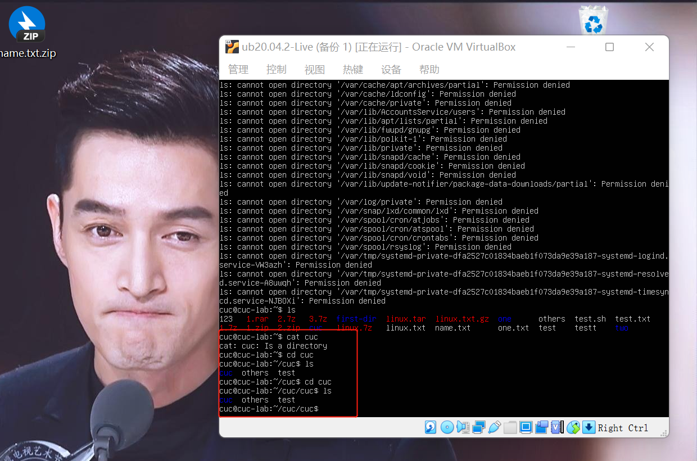
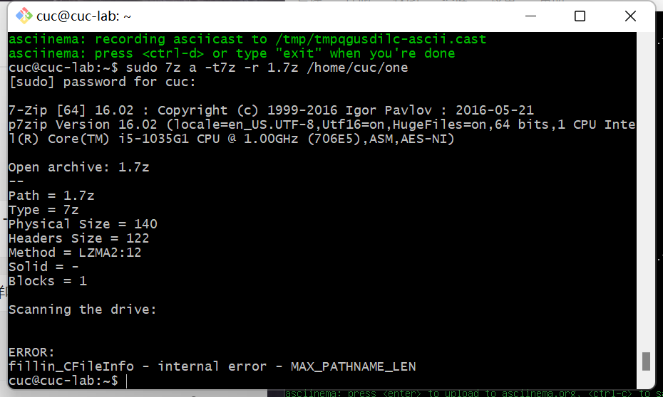
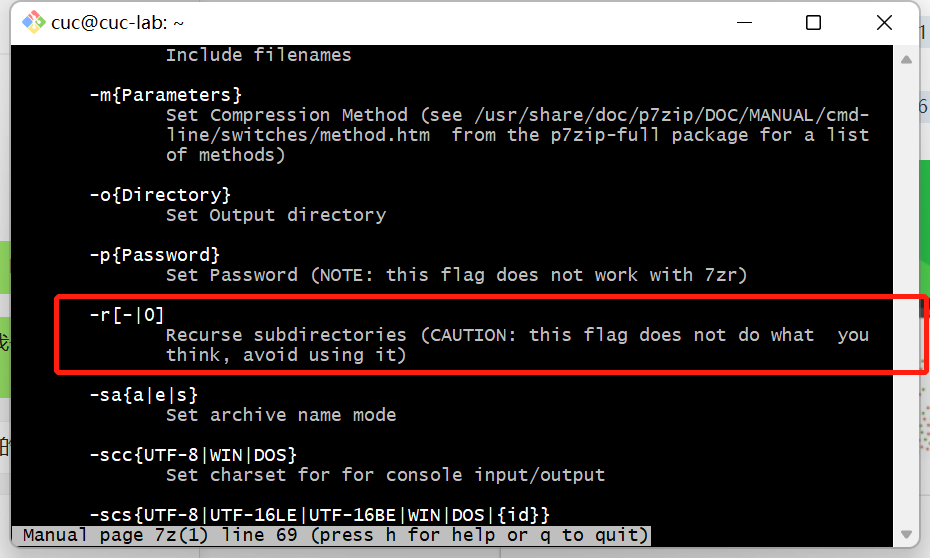

# Linux实验二：Linux命令行使用基础

### 实验环境

- VirtualBox
- Ubuntu 20.04 Server 64bit
- 阿里云平台 CentOS
  
## 实验内容

- 使用表格方式记录至少2个不同Linux发行版本以下信息的获取防范，使用 `acsiinema` 录屏方式【分段】记录相关信息的获取过程和结果

| 实验环境     | Ubuntu 20.04 | CentOS       |
| :---        |    :----:    |          ---: |
| 安装应用      | `sudo apt-get install`      | `yum install -y`     |
| 卸载应用   | `sudo apt-get remove --purge tshark`     | `yum -y remove`   |
| 查看安装路径      | `dpkg -L tmux`    | `rpm -qal | grep tmux`   |
| 查找文件名   | `sudo find ./ type f -name "*666*"`   | `find / -name '*666*'`   |
| 查找文件内容      | `sudo grep -r "666" ./ --exculde=*.cast`       | `find . | xargs grep -ri '666'`  |
| zip压缩与解压缩   |`zip` <br>`unzip -o`| `zip` <br>`unzip -o`|
| bzip压缩与解压缩      | `bzip2`<br> `bunzip2` | `bzip2`<br> `bunzip2`   |
| gzip压缩与解压缩   | `gzip -c linux.txt > linux.txt.gz`<br>`gzip -dk linux.txt.gz` | `gzip -c linux.txt > linux.txt.gz`<br>`gzip -dk linux.txt.gz` |
| tar压缩与解压缩  | `tar -cvf`<br>`tar -xvf` | `tar -cvf`<br>`tar -xvf` |
| 7z压缩与解压缩   | `7z a -t7z` <br> `7z x linux.7z -o./`       | `7za a -t7z`<br>`7za x 1.7z -o./` |
| rar压缩与解压缩   | `sudo rar a`<br> `sudo rar x`     | `wget http://www.rarlab.com/rar/rarlinux-x64-5.3.0.tar.gz --no-check-certificate`<br>`tar -zxvf rarlinux-x64-5.3.0.tar.gz`<br>`cd rar`<br>`make`<br>`rar a`<br>`rar x` |
| 硬件信息获取   | #查看CPU型号<br>`grep "model name" /proc/cpuinfo |awk -F ':' '{print $NF}'`<br>#查看CPU个数<br>`cat /proc/cpuinfo | grep "physical id" | uniq | wc -l`<br>#每个CPU的核数<br>`cat /proc/cpuinfo | grep "cpu cores" | uniq`<br>#内存大小<br>`free -m`<br>#每个内存的大小<br>`dmidecode -t memory |grep -A16 "Memory Device$" |grep "Size:"`<br>#硬盘数量与硬盘容量<br>`sudo fdisk -l |grep "Disk /dev/sd"`  | #CPU大小<br>`cat /proc/cpuinfo |grep "model name" && cat /proc/cpuinfo |grep "physical id"`<br>#查看内存大小<br>`cat /proc/meminfo |grep MemTotal`<br>#查看内存使用量和交换区使用量<br>`free -m`<br>#查看硬盘大小<br>`fdisk -l | grep Disk`<br>#查看各分区使用情况<br>`df -h`|


## 实验问题

- 【软件包管理】在目标发行版上安装tmux和tshrak；查看这2个软件被安装到哪些路径；卸载tshark；验证tshark卸载结果

- 【文件管理】复制以下shell代码到终端运行，在目标Linux发行版系统中构造测试数据集，然后回答以下问题：

    - 找到 `/tmp` 目录及其所有子目录下，文件名包含 `666` 的所有文件

    - 找到 `/tmp` 目录及其所有子目录下，文件内容包含 `666` 的所有文件

```shell
cd /tmp && for i in $(seq 0 1024);do dir="test-$RANDOM";mkdir "$dir";echo "$RANDOM" > "$dir/$dir-$RANDOM";done
```

- 【文件压缩与解压缩】练习课件中[ 文件压缩与解压缩](https://c4pr1c3.github.io/LinuxSysAdmin/chap0x02.md.html#/12/1)一节提到的压缩与解压缩命令的使用方法

- 【跟练】[子进程管理实验](https://asciinema.org/a/f3ux5ogwbxwo2q0wxxd0hmn54)

- 【硬件信息获取】目标系统的CPU、内存大小、硬盘数量与硬盘容量

## 实验过程及结果

- Ubuntu 首先根据官网提示进行操作：
```shell
sudo apt-add-repository ppa:zanchey/asciinema
sudo apt install asciinema
asciinema auth
```

- CentOS
```shell
#安装asciinema
yum install -y asciinema

#进行自动配置，打开给你的链接，进行简单的注册
asciinema auth

#开启录制，你的录制内容，将会自动上传到他的官方网站
asciinema rec
```

#### 1.软件包管理

**Ubuntu 20.04**

（1）tmux

- 安装：
```shell
sudo apt install tmux
```

- 查看安装版本：
```shell
apt-cache policy tmux
```

- 查看被安装到了哪个路径上:
```shell
dpkg -L tmux
```

[](https://asciinema.org/a/3xtoUsnJxcRBLcnKqmP2hbeej)

（2）tshark

- 安装：
```shell
sudo apt install tshark
```

- 查看安装版本：
```shell
apt-cache policy tshark
```

- 查看被安装到了哪个路径上:
```shell
dpkg -L tshark
```

- 卸载tshark
```shell
sudo apt-get remove --purge tshark
```

- 验证tshark卸载结果
```shell
dpkg -L tshark
```

[](https://asciinema.org/a/TD5DnUVXwheFQAwxHtdc7QLrq)

---

**阿里云平台：CentOS**

（1）tmux

- 安装
```shell
yum install tmux
```

- 查看安装路径
```shell
rpm -qal |grep tmux
```

[](https://asciinema.org/a/v6iKsANniIwJMHjMjVXLb0tI4)

（2）tshark

- tshark是网络分析工具wireshark下的一个工具，主要用于命令行环境进行抓包、分析,但是CentOS中没有tshark包，wireshark包含tshark，所以直接安装wireshark

- 安装
```shell
yum install wireshark
```

- 卸载
```shell
yum -y remove wireshark
``` 

[](https://asciinema.org/a/8dRRQvzY5JvNqAWTTT5KqdNeD)

#### 2.文件管理

首先执行命令：
```shell
cd /tmp && for i in $(seq 0 1024);do dir="test-$RANDOM";mkdir "$dir";echo "$RANDOM" > "$dir/$dir-$RANDOM";done
```

**Ubuntu 20.04**

- 找到 `/tmp` 目录及其所有子目录下，文件名包含 `666` 的所有文件
```shell
sudo find ./ type f -name "*666*"
```

- 找到 `/tmp` 目录及其所有子目录下，文件内容包含 `666` 的所有文件
```shell
sudo grep -r "666" ./ --exculde=*.cast
```

[](https://asciinema.org/a/xjFXroCfOiKFnKAypeqEL2Mld)

---

**阿里云平台：CentOS**

- 找到 `/tmp` 目录及其所有子目录下，文件名包含 `666` 的所有文件
```shell
find / -name '*666*'
```

- 找到 `/tmp` 目录及其所有子目录下，文件内容包含 `666` 的所有文件
```shell
find . | xargs grep -ri '666'
```

[](https://asciinema.org/a/Krug9TnfyxZ11OdctEbS2TgVo)

#### 3.文件压缩与解压缩

**Ubuntu 20.04**

> 1.`zip`压缩，`unzip`解压缩

- 安装 `zip,unzip`
```shell
sudo apt-get install zip
sudo apt-get install unzip
```

- 首先，查看虚拟机内都有哪些文件可以压缩
```shell
ls
```

- 发现 `linux.txt` 为可压缩文件
```shell
zip 2.zip linux.txt
```

- 解压缩
```shell
unzip -o 2.zip
```

[](https://asciinema.org/a/I03uGqigiRiNEE0tcblQVPDk2)

> 2.`bzip2`压缩，`bunzip2`解压缩

- 压缩命令：
```shell
bzip2 linux.txt
```

- 解压缩
```shell
bunzip2 linux.txt.bz2
```

[](https://asciinema.org/a/DVJUeZsQDhBLEgV4cEh3WaFWL)

> 3.`gzip`压缩，`gunzip`解压缩

- 压缩：
```shell
gzip -c linux.txt > linux.txt.gz
```

只使用`gzip`命令会自动删除源文件，上述命令可保留源文件

- 解压缩：
```shell
gzip -dk linux.txt.gz
```

[](https://asciinema.org/a/xwmo1pY7leloedYI6wmX6bFAE)

> 4.tar

- 压缩
```shell
tar -cvf linux.tar linux.txt
```

- 解压缩
```shell
tar -xvf linux.tar
```

[](https://asciinema.org/a/urNDFhHroZqPX98LMN8IfYGD3)

> 5.7z(p7zip)

- 安装
```shell
sudo apt install p7zip-full
```

- 压缩
```shell
7z a -t7z linux.7z ./linux.txt
```

- 解压缩
```shell
7z x linux.7z -o./
```

[](https://asciinema.org/a/5GHg4FKQPHP6Jf0exCzEGz0WI)

> 6.rar(p7zip-rar/unrar-free)

- 压缩
```shell
sudo rar a 1.rar linux.txt
```

- 解压缩
```shell
sudo rar x 1.rar
```

[](https://asciinema.org/a/MhQTSq5iR2GQsDg4R8TG5oS7A)

--- 

**阿里云平台：CentOS**

- `CentOS` 与 `Ubuntu20.04` 的`zip` ，`bzip2` , `gzip` , `tar`的命令都一样

- 7z

```shell
#压缩
7za a -t7z 1.7z 1.txt
#解压缩
7za x 1.7z -o./
```

[](https://asciinema.org/a/6iPBwvoPXZVV62qZmvpIe0k1M)

- rar
```shell
#查看内核版本是32位还是64位（我是64位）
uname -a
#下载对应64位的rar软件包
wget http://www.rarlab.com/rar/rarlinux-x64-5.3.0.tar.gz --no-check-certificate
#解压安装包
tar -zxvf rarlinux-x64-5.3.0.tar.gz
#进入解压出的“rar”文件夹
cd rar
#进行配置
make
#出现下面的信息就成功了
mkdir -p /usr/local/binmkdir -p /usr/local/libcp rar unrar /usr/local/bincp rarfiles.lst /etccp default.sfx /usr/local/lib
#压缩
rar a 1.rar 1.txt
#解压缩
rar x 1.rar
```

[](https://asciinema.org/a/CmiNb07EcwhpU9HIPsXtW22zJ)

#### 4.子进程管理实验

**Ubuntu 20.04**

[](https://asciinema.org/a/r4kHVCefqTMqaLUQn0TgdhZk2)

---

**阿里云平台：CentOS**

[](https://asciinema.org/a/V3FOBjzdYaOL3BroKj5b0Ek2r)

#### 5.硬件信息获取

**Ubuntu 20.04**

目标系统的CPU

- 查看CPU型号

```shell
grep "model name" /proc/cpuinfo |awk -F ':' '{print $NF}'
```

- 查看CPU个数
```shell
cat /proc/cpuinfo | grep "physical id" | uniq | wc -l
```

- 每个CPU的核数
```shell
cat /proc/cpuinfo | grep "cpu cores" | uniq
```

- 内存大小
```shell
free -m
```

- 每个内存的大小
```shell
dmidecode -t memory |grep -A16 "Memory Device$" |grep "Size:"
```

- 硬盘数量与硬盘容量
```shell
sudo fdisk -l |grep "Disk /dev/sd"
```

[](https://asciinema.org/a/N3zTjqddAyjRPFOdkiuTntfp1)

---

**阿里云平台：CentOS**

- CPU大小
```shell
cat /proc/cpuinfo |grep "model name" && cat /proc/cpuinfo |grep "physical id"
```

- 内存
```shell
# 内存大小
cat /proc/meminfo |grep MemTotal
# 查看内存使用量和交换区使用量
free -m
```

- 硬盘
```shell
# 硬盘大小
fdisk -l | grep Disk
# 查看各分区使用情况
df -h
```

[](https://asciinema.org/a/WGzAXCH53XstqiHkPPX7L20vk)

## 遇到的错误

- 7z压缩时一直不成功
```shell
7z a -t7z -r linux.7z ./linux.txt
```
- 猜测原因：命令中含有 `-r` ,原本以为压缩的是单个文件，不能用`-r`递归，但是我试了带着 `-r` 压缩文件夹，也不行，猜测是版本问题，但是黄玮老师的设备上原模原样的命令没有任何报错，所以应该是我的一些错误操作导致的。在此非常感谢黄玮老师的指导。
- 解决方式：非常感谢谌雯馨师姐的指导，我删去 `-r` 就可以正常压缩。
- 根本原因：非常感谢吕九洋师哥耐心指导，终于找到了根本错误，原因是我有一个循环嵌套的 `cuc` 文件夹。
- 操作过程
在Ubuntu 20.04里面执行：

```shell
ls -R /* > name.txt
```

得到一个 `name.txt`，把这个文件发给了吕九洋师哥，我最开始`scp`命令输错了，把cuc文件夹下面的所有东西都压缩成一个`name.txt.zip`里面，并且里面并没有`name.txt`

```shell
scp -r cuc@192.168.56.101:/home/cuc name.txt
```

正确的scp命令应该是这样的，才会有`name.txt`
```shell
scp -r cuc@192.168.56.101:/home/cuc/name.txt name.txt
```

发给吕九洋师哥之后，他发现我的文件夹里面有问题，`cuc`文件夹里面循环嵌套了好多`cuc`文件夹，如下图所示：



然后师哥让我试试下面这两个命令：

```shell
sudo 7z a -t7z -r 1.7z one
sudo 7z a -t7z -r 1.7z /home/cuc/one
```

就回到了最开始的报错，如下图：



[](https://asciinema.org/a/CUWJ49CaLv7RLFf9yYD0NdDie)

接着，输入`man 7z`，官方文档说不要用`-r`



然后吕九洋师哥写了一个错误分析文档，写的真的太好了！在此附上~

[吕九洋师哥的分析文档](A%20potentially%20imprecise%20analysis---ljy.pdf)

- 最后的解决办法：重装系统，这次带上`-r`也可以正常压缩了

[](https://asciinema.org/a/rQMYB8LWOu7YFGFg3vD4Ajy5d)


## 参考资料

[Ubuntu apt 卸载详解](https://blog.csdn.net/u012843189/article/details/81720854)

[Linux find命令](https://www.cnblogs.com/mayou18/p/9552818.html)

[Linux 压缩命令大全](https://www.php.cn/linux-441774.html)

[Ubuntu下查看CPU、内存和硬盘详细信息](https://blog.csdn.net/zhizhengguan/article/details/88353166)

[CentOS如何解压rar格式文件](https://www.php.cn/centos/446562.html)

[CentOS下查看cpu，内存，硬盘等硬件信息的方法](https://www.centoschina.cn/course/introduction/9527.html)