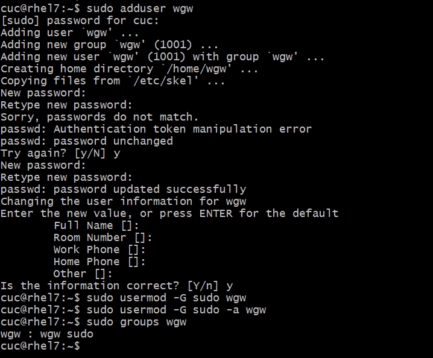
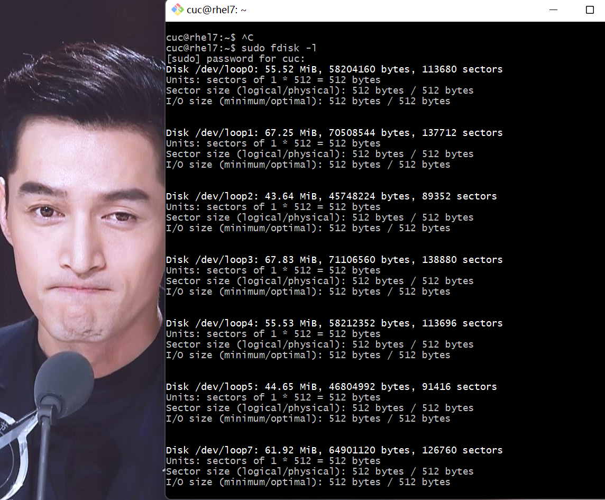
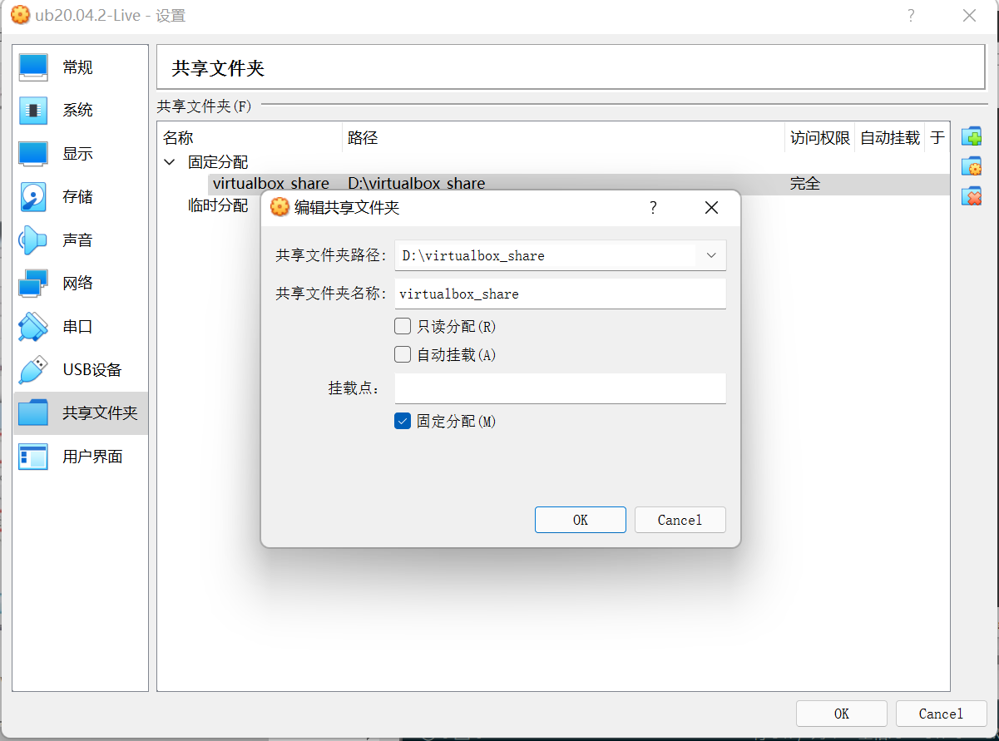
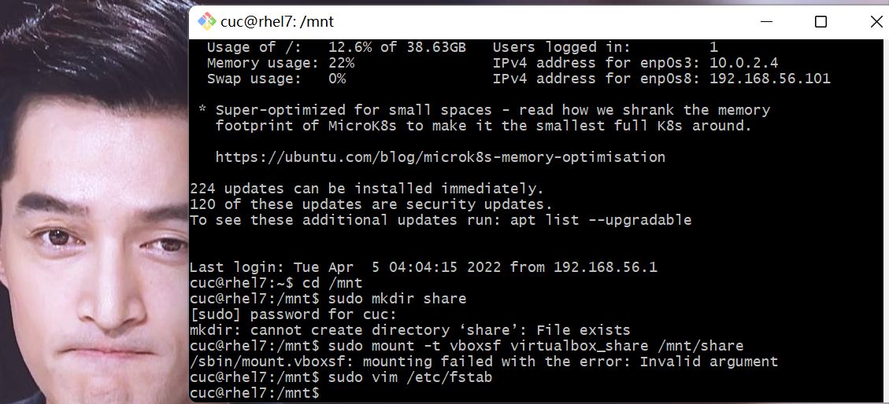
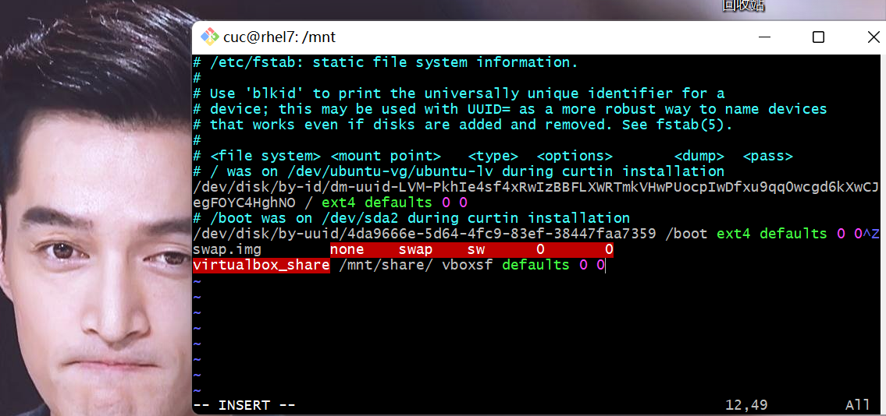
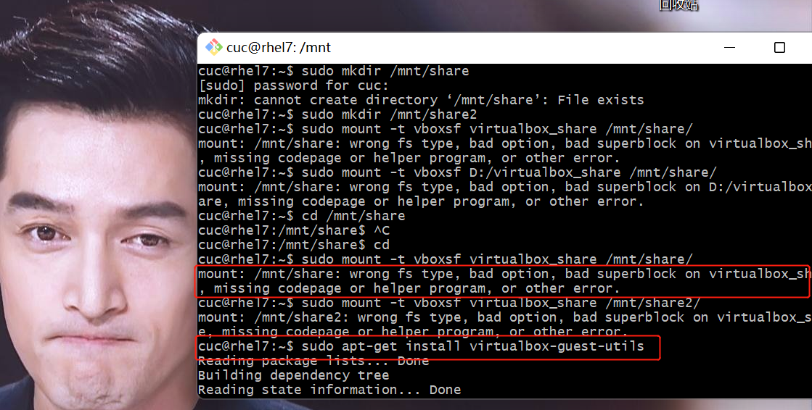

# Linux实验二：Linux命令行使用基础

### 实验环境

- VirtualBox
- Ubuntu 20.04 Server 64bit
  
## 实验内容

1. 根据教程完成实验
   1. [Systemd 入门教程：命令篇](http://www.ruanyifeng.com/blog/2016/03/systemd-tutorial-commands.html)
   2. [Systemd 入门教程：实战篇](http://www.ruanyifeng.com/blog/2016/03/systemd-tutorial-part-two.html)
2. 根据课件完成自查清单
   1. [自查清单](https://c4pr1c3.github.io/LinuxSysAdmin/chap0x03.md.html#/15/1)

## 实验过程

### 命令篇

#### 一.系统管理

3.2 `systemd-analyze`：查看启动耗时

```shell
# 查看启动耗时
$ systemd-analyze                                                                                       

# 查看每个服务的启动耗时
$ systemd-analyze blame

# 显示瀑布状的启动过程流
$ systemd-analyze critical-chain

# 显示指定服务的启动流
$ systemd-analyze critical-chain atd.service
```

[](https://asciinema.org/a/wVDb0kvQhGJ24Ap1jTXE0ybX1)

3.3 `hostnamectl`：查看当前主机的信息

```shell
# 显示当前主机的信息
$ hostnamectl

# 设置主机名。
$ sudo hostnamectl set-hostname rhel7
```

[](https://asciinema.org/a/2wskhq5n80QHSBMcUBBKgtZHX)

3.4 `localectl`：查看本地化设置

```shell
# 查看本地化设置
$ localectl

# 设置本地化参数。
$ sudo localectl set-locale LANG=en_GB.utf8
$ sudo localectl set-keymap en_GB
```

[](https://asciinema.org/a/2KzDZl71djyMhz4VoW2CEeNM6)

3.5 `timedatectl`:查看当前时区设置

```shell
# 查看当前时区设置
$ timedatectl

# 显示所有可用的时区
$ timedatectl list-timezones                                                                                   

# 设置当前时区
$ sudo timedatectl set-timezone America/New_York
$ sudo timedatectl set-time YYYY-MM-DD
$ sudo timedatectl set-time HH:MM:SS
```

[](https://asciinema.org/a/UdHxeZcX9TlV5YXyxXleFCkHX)

3.6 `loginctl`:查看当前登录的用户

```shell
# 列出当前session
$ loginctl list-sessions

# 列出当前登录用户
$ loginctl list-users

# 列出显示指定用户的信息
$ loginctl show-user ruanyf
```

[](https://asciinema.org/a/ieIw4L7R1EUJeJ9tozMsJIZpY)


#### 二.Unit

4.1 `systemctl list-units`:命令可以查看当前系统的所有 Unit 

```shell
# 列出正在运行的 Unit
$ systemctl list-units

# 列出所有Unit，包括没有找到配置文件的或者启动失败的
$ systemctl list-units --all

# 列出所有没有运行的 Unit
$ systemctl list-units --all --state=inactive

# 列出所有加载失败的 Unit
$ systemctl list-units --failed

# 列出所有正在运行的、类型为 service 的 Unit
$ systemctl list-units --type=service
```

[](https://asciinema.org/a/eGNdN6Z8kzFnXbYt5QHnt7Mhi)

4.2 Unit 的状态

- systemctl status命令用于查看系统状态和单个 Unit 的状态。

```shell
# 显示系统状态
$ systemctl status

# 显示单个 Unit 的状态
$ sysystemctl status bluetooth.service

# 显示远程主机的某个 Unit 的状态
$ systemctl -H root@rhel7.example.com status httpd.service
```

- 除了status命令，systemctl还提供了三个查询状态的简单方法，主要供脚本内部的判断语句使用。

```shell
systemctl status命令用于查看系统状态和单个 Unit 的状态。

# 显示系统状态
$ systemctl status

# 显示单个 Unit 的状态
$ sysystemctl status bluetooth.service

# 显示远程主机的某个 Unit 的状态
$ systemctl -H root@rhel7.example.com status httpd.service
除了status命令，systemctl还提供了三个查询状态的简单方法，主要供脚本内部的判断语句使用。
```

[](https://asciinema.org/a/qS7NIb4wBny1CMtrloOuHNVe2)


4.3 Unit管理

对于用户来说，最常用的是下面这些命令，用于启动和停止 Unit（主要是 service）

```shell
# 立即启动一个服务
$ sudo systemctl start apache.service

# 立即停止一个服务
$ sudo systemctl stop apache.service

# 重启一个服务
$ sudo systemctl restart apache.service

# 杀死一个服务的所有子进程
$ sudo systemctl kill apache.service

# 重新加载一个服务的配置文件
$ sudo systemctl reload apache.service

# 重载所有修改过的配置文件
$ sudo systemctl daemon-reload

# 显示某个 Unit 的所有底层参数
$ systemctl show httpd.service

# 显示某个 Unit 的指定属性的值
$ systemctl show -p CPUShares httpd.service

# 设置某个 Unit 的指定属性
$ sudo systemctl set-property httpd.service CPUShares=500
```

[](https://asciinema.org/a/nnG9NIpUAy6QaY3MBE8gO0eQB)


4.4 依赖关系

Unit 之间存在依赖关系：A 依赖于 B，就意味着 Systemd 在启动 A 的时候，同时会去启动 B。

- systemctl list-dependencies命令列出一个 Unit 的所有依赖。

```shell
systemctl list-dependencies nginx.service
```

- 上面命令的输出结果之中，有些依赖是 Target 类型（详见下文），默认不会展开显示。如果要展开 Target，就需要使用--all参数。

```shell
systemctl list-dependencies --all nginx.service
```

[](https://asciinema.org/a/RjD579jhU7DicpbgHinypIjLU)

#### 三.Unit的配置文件

5.1 概述
每一个Unit都有一个配置文件，告诉 Systemd 怎么启动这个 Unit 。

Systemd 默认从目录`/etc/systemd/system/`读取配置文件。但是，里面存放的大部分文件都是符号链接，指向目录`/usr/lib/systemd/system/`，真正的配置文件存放在那个目录。

`systemctl enable`命令用于在上面两个目录之间，建立符号链接关系。

```shell
$ sudo systemctl enable clamd@scan.service
# 等同于
$ sudo ln -s '/usr/lib/systemd/system/clamd@scan.service' '/etc/systemd/system/multi-user.target.wants/clamd@scan.service'
```

如果配置文件里面设置了开机启动，`systemctl enable`命令相当于激活开机启动。

与之对应的，`systemctl disable`命令用于在两个目录之间，撤销符号链接关系，相当于撤销开机启动。

```shell
$ sudo systemctl disable clamd@scan.service
```

配置文件的后缀名，就是该 Unit 的种类，比如`sshd.socket`。如果省略，Systemd 默认后缀名为`.service`，所以`sshd`会被理解成`sshd.service`。

5.2 配置文件的状态

`systemctl list-unit-files`命令用于列出所有配置文件。

```shell
# 列出所有配置文件
$ systemctl list-unit-files

# 列出指定类型的配置文件
$ systemctl list-unit-files --type=service
```

这个命令会输出一个列表。

```shell
$ systemctl list-unit-files

UNIT FILE              STATE
chronyd.service        enabled
clamd@.service         static
clamd@scan.service     disabled
```

这个列表显示每个配置文件的状态，一共有四种。

```shell
- enabled：已建立启动链接
- disabled：没建立启动链接
- static：该配置文件没有[Install]部分（无法执行），只能作为其他配置文件的依赖
- masked：该配置文件被禁止建立启动链接
```

注意，从配置文件的状态无法看出，该 Unit 是否正在运行。这必须执行前面提到的`systemctl status`命令。

```shell
$ systemctl status bluetooth.service
```

一旦修改配置文件，就要让 SystemD 重新加载配置文件，然后重新启动，否则修改不会生效。

```shell
$ sudo systemctl daemon-reload
$ sudo systemctl restart httpd.service
```

5.3 配置文件的格式

配置文件就是普通的文本文件，可以用文本编辑器打开。

`systemctl cat`命令可以查看配置文件的内容。

```shell
$ systemctl cat atd.service

[Unit]
Description=ATD daemon

[Service]
Type=forking
ExecStart=/usr/bin/atd

[Install]
WantedBy=multi-user.target
```

从上面的输出可以看到，配置文件分成几个区块。每个区块的第一行，是用方括号表示的区别名，比如`[Unit]`。注意，配置文件的区块名和字段名，都是大小写敏感的。

每个区块内部是一些等号连接的键值对。

```shell
[Section]
Directive1=value
Directive2=value

. . .
```

5.4配置文件的区块

`[Unit]`区块通常是配置文件的第一个区块，用来定义 Unit 的元数据，以及配置与其他 Unit 的关系。它的主要字段如下。

```shell
Description：简短描述
Documentation：文档地址
Requires：当前 Unit 依赖的其他 Unit，如果它们没有运行，当前 Unit 会启动失败
Wants：与当前 Unit 配合的其他 Unit，如果它们没有运行，当前 Unit 不会启动失败
BindsTo：与Requires类似，它指定的 Unit 如果退出，会导致当前 Unit 停止运行
Before：如果该字段指定的 Unit 也要启动，那么必须在当前 Unit 之后启动
After：如果该字段指定的 Unit 也要启动，那么必须在当前 Unit 之前启动
Conflicts：这里指定的 Unit 不能与当前 Unit 同时运行
Condition...：当前 Unit 运行必须满足的条件，否则不会运行
Assert...：当前 Unit 运行必须满足的条件，否则会报启动失败
```

`[Install]`通常是配置文件的最后一个区块，用来定义如何启动，以及是否开机启动。它的主要字段如下。

```shell
WantedBy：它的值是一个或多个 Target，当前 Unit 激活时（enable）符号链接会放入/etc/systemd/system目录下面以 Target 名 + .wants后缀构成的子目录中
RequiredBy：它的值是一个或多个 Target，当前 Unit 激活时，符号链接会放入/etc/systemd/system目录下面以 Target 名 + .required后缀构成的子目录中
Alias：当前 Unit 可用于启动的别名
Also：当前 Unit 激活（enable）时，会被同时激活的其他 Unit
```

`[Service]`区块用来 Service 的配置，只有 Service 类型的 Unit 才有这个区块。它的主要字段如下。

```shell
Type：定义启动时的进程行为。它有以下几种值。
Type=simple：默认值，执行ExecStart指定的命令，启动主进程
Type=forking：以 fork 方式从父进程创建子进程，创建后父进程会立即退出
Type=oneshot：一次性进程，Systemd 会等当前服务退出，再继续往下执行
Type=dbus：当前服务通过D-Bus启动
Type=notify：当前服务启动完毕，会通知Systemd，再继续往下执行
Type=idle：若有其他任务执行完毕，当前服务才会运行
ExecStart：启动当前服务的命令
ExecStartPre：启动当前服务之前执行的命令
ExecStartPost：启动当前服务之后执行的命令
ExecReload：重启当前服务时执行的命令
ExecStop：停止当前服务时执行的命令
ExecStopPost：停止当其服务之后执行的命令
RestartSec：自动重启当前服务间隔的秒数
Restart：定义何种情况 Systemd 会自动重启当前服务，可能的值包括always（总是重启）、on-success、on-failure、on-abnormal、on-abort、on-watchdog
TimeoutSec：定义 Systemd 停止当前服务之前等待的秒数
Environment：指定环境变量
```

Unit 配置文件的完整字段清单，请参考[官方文档](https://www.freedesktop.org/software/systemd/man/systemd.unit.html)。

[](https://asciinema.org/a/VPMJrzsmp4AzEGPNahDR7Ii1S)


#### 四.Target

启动计算机的时候，需要启动大量的 Unit。如果每一次启动，都要一一写明本次启动需要哪些 Unit，显然非常不方便。Systemd 的解决方案就是 Target。

简单说，Target 就是一个 Unit 组，包含许多相关的 Unit 。启动某个 Target 的时候，Systemd 就会启动里面所有的 Unit。从这个意义上说，Target 这个概念类似于"状态点"，启动某个 Target 就好比启动到某种状态。

传统的`init`启动模式里面，有 RunLevel 的概念，跟 Target 的作用很类似。不同的是，RunLevel 是互斥的，不可能多个 RunLevel 同时启动，但是多个 Target 可以同时启动。

```shell
# 查看当前系统的所有 Target
$ systemctl list-unit-files --type=target

# 查看一个 Target 包含的所有 Unit
$ systemctl list-dependencies multi-user.target

# 查看启动时的默认 Target
$ systemctl get-default

# 设置启动时的默认 Target
$ sudo systemctl set-default multi-user.target

# 切换 Target 时，默认不关闭前一个 Target 启动的进程，
# systemctl isolate 命令改变这种行为，
# 关闭前一个 Target 里面所有不属于后一个 Target 的进程
$ sudo systemctl isolate multi-user.target
```

Target 与 传统 RunLevel 的对应关系如下。

```shell
Traditional runlevel      New target name     Symbolically linked to...

Runlevel 0           |    runlevel0.target -> poweroff.target
Runlevel 1           |    runlevel1.target -> rescue.target
Runlevel 2           |    runlevel2.target -> multi-user.target
Runlevel 3           |    runlevel3.target -> multi-user.target
Runlevel 4           |    runlevel4.target -> multi-user.target
Runlevel 5           |    runlevel5.target -> graphical.target
Runlevel 6           |    runlevel6.target -> reboot.target
```

它与`init`进程的主要差别如下。

```shell
（1）默认的 RunLevel（在`/etc/inittab`文件设置）现在被默认的 Target 取代，位置是`/etc/systemd/system/default.target`，通常符号链接到`graphical.target`（图形界面）或者`multi-user.target`（多用户命令行）。

（2）启动脚本的位置，以前是`/etc/init.d`目录，符号链接到不同的 RunLevel 目录 （比如`/etc/rc3.d`、`/etc/rc5.d`等），现在则存放在`/lib/systemd/system`和`/etc/systemd/system`目录。

（3）配置文件的位置，以前init进程的配置文件是`/etc/inittab`，各种服务的配置文件存放在`/etc/sysconfig`目录。现在的配置文件主要存放在`/lib/systemd`目录，在`/etc/systemd`目录里面的修改可以覆盖原始设置。
```

[](https://asciinema.org/a/myFhxqveaanuVi1rbOnDotQOy)

#### 五.日志管理

Systemd 统一管理所有 Unit 的启动日志。带来的好处就是，可以只用`journalctl`一个命令，查看所有日志（内核日志和应用日志）。日志的配置文件是`/etc/systemd/journald.conf`。

`journalctl`功能强大，用法非常多。

```shell
# 查看所有日志（默认情况下 ，只保存本次启动的日志）
$ sudo journalctl

# 查看内核日志（不显示应用日志）
$ sudo journalctl -k

# 查看系统本次启动的日志
$ sudo journalctl -b
$ sudo journalctl -b -0

# 查看上一次启动的日志（需更改设置）
$ sudo journalctl -b -1

# 查看指定时间的日志
$ sudo journalctl --since="2012-10-30 18:17:16"
$ sudo journalctl --since "20 min ago"
$ sudo journalctl --since yesterday
$ sudo journalctl --since "2015-01-10" --until "2015-01-11 03:00"
$ sudo journalctl --since 09:00 --until "1 hour ago"

# 显示尾部的最新10行日志
$ sudo journalctl -n

# 显示尾部指定行数的日志
$ sudo journalctl -n 20

# 实时滚动显示最新日志
$ sudo journalctl -f

# 查看指定服务的日志
$ sudo journalctl /usr/lib/systemd/systemd

# 查看指定进程的日志
$ sudo journalctl _PID=1

# 查看某个路径的脚本的日志
$ sudo journalctl /usr/bin/bash

# 查看指定用户的日志
$ sudo journalctl _UID=33 --since today

# 查看某个 Unit 的日志
$ sudo journalctl -u nginx.service
$ sudo journalctl -u nginx.service --since today

# 实时滚动显示某个 Unit 的最新日志
$ sudo journalctl -u nginx.service -f

# 合并显示多个 Unit 的日志
$ journalctl -u nginx.service -u php-fpm.service --since today

# 查看指定优先级（及其以上级别）的日志，共有8级
# 0: emerg
# 1: alert
# 2: crit
# 3: err
# 4: warning
# 5: notice
# 6: info
# 7: debug
$ sudo journalctl -p err -b

# 日志默认分页输出，--no-pager 改为正常的标准输出
$ sudo journalctl --no-pager

# 以 JSON 格式（单行）输出
$ sudo journalctl -b -u nginx.service -o json

# 以 JSON 格式（多行）输出，可读性更好
$ sudo journalctl -b -u nginx.serviceqq
 -o json-pretty

# 显示日志占据的硬盘空间
$ sudo journalctl --disk-usage

# 指定日志文件占据的最大空间
$ sudo journalctl --vacuum-size=1G

# 指定日志文件保存多久
$ sudo journalctl --vacuum-time=1years
```

[](https://asciinema.org/a/8TzhVrtAaO9piAWe9JaP4fzwP)


### 实战篇

[](https://asciinema.org/a/rEJh2JpxdPrBcOtgrYtbYzlPP)

### 自查清单

1. 如何添加一个用户并使其具备sudo执行程序的权限？

```shell
# 添加用户
sudo adduser wgw
#添加sudo权限
sudo usermod -G sudo wgw
```



2. 如何将一个用户添加到一个用户组？

```shell
# 查看用户组
cat /etc/group
# 创建新的用户组
sudo addgroup 组名称
# 把用户添加到用户组
sudo gpasswd -a user_name group_name
```

[](https://asciinema.org/a/RC8eLFB8yfWTelNHH8OXiJEQJ)

3. 如何查看当前系统的分区表和文件系统详细信息？

```shell
sudo fdisk -l
```



4. 如何实现开机自动挂载Virtualbox的共享目录分区？

> 什么是挂载？

> 挂载，指的就是将设备文件中的顶级目录连接到 Linux 根目录下的某一目录（最好是空目录），访问此目录就等同于访问设备文件。

> 纠正一个误区，并不是根目录下任何一个目录都可以作为挂载点，由于挂载操作会使得原有目录中文件被隐藏，因此根目录以及系统原有目录都不要作为挂载点，会造成系统异常甚至崩溃，挂载点最好是新建的空目录。

- 首先，在宿主机中创建一个共享文件夹，名为`virtualbox_share`,并在virtualbox的  设备--> 共享文件夹  里面设置好:



- 在虚拟机的`/mnt`目录下新建一个共享文件的挂载目录，并新建一个共享文件夹，命名为`share`

```shell
#进入 /mnt目录
cd /mnt
# 新建共享文件夹
sudo mkdir share
```

- 执行挂载命令

```shell
# sudo mount -t vboxsf [Windows共享文件夹名称] [Ubuntu共享目录]
sudo mount -t vboxsf virtualbox_share /mnt/share
```



- 修改`/etc/fstab`文件，在文末添加

```shell
# [Windows共享文件夹名称] /mnt/share/ vboxsf defaults 0 0
virtualbox_share /mnt/share/ vboxsf defaults 0 0
```



5. 基于LVM（逻辑分卷管理）的分区如何实现动态扩容和缩减容量？

```shell
# 扩容
lvextend -L +<扩容大小> <挂载目录>
# 减容
lvreduce -L -<减容大小> <挂载目录>
```

6. 如何通过systemd设置实现在网络连通时运行一个指定脚本，在网络断开时运行另一个脚本？

```shell
cd /etc/systemd/system
systemctl cat systemd-networkd.service
systemctl daemon-reload
sudo systemctl stop systemd-networkd.service
sudo systemctl start systemd-networkd.service
sudo systemctl stop systemd-networkd.socket
```

[](https://asciinema.org/a/vb7oojWHSwylwacs7m7hgEk2g)

7. 如何通过systemd设置实现一个脚本在任何情况下被杀死之后会立即重新启动？实现杀不死？

- 修改服务配置文件`Service`

```shell
StartLimitIntervalSec=0
Restart=always
RestartSec=1
```

- 重新加载配置文件

```shell
sudo systemctl daemon-reload
```

就可以了。

## 实验过程中遇到的问题

- 在实现自动挂载时出现报错：

```shell
mount: /mnt/share: wrong fs type, bad option, bad superblock on virtualbox_share, missing codepage or helper program, or other error.
```

- 解决方式：

```shell
sudo apt-get install virtualbox-guest-utils
```



## 参考资料

[Systemd 入门教程：命令篇](http://www.ruanyifeng.com/blog/2016/03/systemd-tutorial-commands.html)

[Systemd 入门教程：实战篇](http://www.ruanyifeng.com/blog/2016/03/systemd-tutorial-part-two.html)

[Ubuntu创建用户，给予sudo权限](https://blog.csdn.net/wowocpp/article/details/100115112)

[ubuntu20.04 创建新的用户,并添加到用户组](https://blog.csdn.net/qq_41166909/article/details/121735361)

[Linux挂载](http://c.biancheng.net/view/2859.html)

[Linux之systemd服务配置及自动重启](https://blog.csdn.net/zong596568821xp/article/details/102739649)