# Linux实验四：shell脚本编程基础

### 实验环境

- VirtualBox
- Ubuntu 20.04 Server 64bit
- VSCode

## 实验内容

#### 任务一：用bash编写一个图片批处理脚本，实现以下功能：

- [x] 支持命令行参数方式使用不同功能
- [x] 支持对指定目录下所有支持格式的图片文件进行批处理
- [x] 支持以下常见图片批处理功能的单独使用或组合使用
  - [x] 支持对jpeg格式图片进行图片质量压缩
  - [x] 支持对jpeg/png/svg格式图片在保持原始宽高比的前提下压缩分辨率
  - [x] 支持对图片批量添加自定义文本水印
  - [x] 支持批量重命名（统一添加文件名前缀或后缀，不影响原始文件扩展名）
  - [x] 支持将png/svg图片统一转换为jpg格式图片

#### 任务二：用bash编写一个文本批处理脚本，对以下附件分别进行批量处理完成相应的数据统计任务：

- [x] 统计不同年龄区间范围（20岁以下、[20-30]、30岁以上）的球员数量、百分比
- [x] 统计不同场上位置的球员数量、百分比
- [x] 名字最长的球员是谁？名字最短的球员是谁？
- [x] 年龄最大的球员是谁？年龄最小的球员是谁？

#### 任务三：用bash编写一个文本批处理脚本，对以下附件分别进行批量处理完成相应的数据统计任务：

- [x] 统计访问来源主机TOP 100和分别对应出现的总次数
- [x] 统计访问来源主机TOP 100 IP和分别对应出现的总次数
- [x] 统计最频繁被访问的URL TOP 100
- [x] 统计不同响应状态码的出现次数和对应百分比
- [x] 分别统计不同4XX状态码对应的TOP 10 URL和对应出现的总次数
- [x] 给定URL输出TOP 100访问来源主机

## 实验过程

### 任务一：图片批处理

- 首先，安装`shellcheck`和`imagemagick`

```shell
sudo apt-get update
sudo apt-get install shellcheck
sudo apt-get install imagemagick
```

- 其次，将本地的格式分别为`png`,`jpeg`,`svg`的三张图片上传到虚拟机

```shell
scp -r D:/大二-下/Linux/chap0x04/img cuc@192.168.56.101:/home/cuc/experiment4/
```

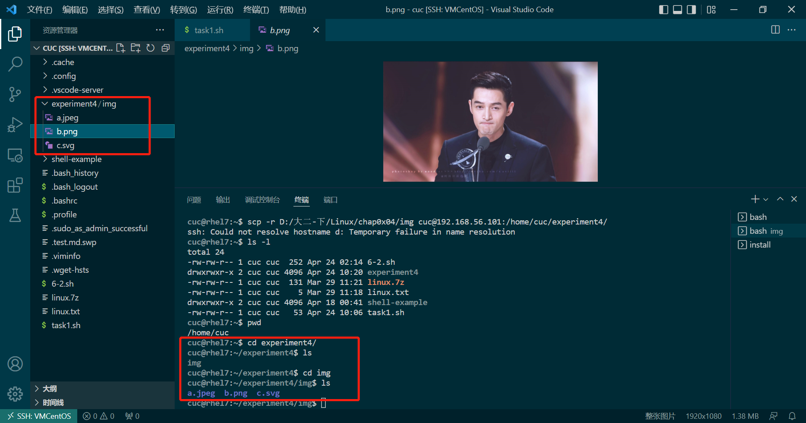

- 支持通过命令行参数方式使用不同功能，命令行的参数可以决定使用的功能。内置help函数帮助理解脚本功能。编写help函数解释命令行参数功能。

```shell
function help {
    echo "doc"
    echo "-q Q                      对jpeg格式图片进行图片质量因子为Q的压缩"
    echo "-r R                      对jpeg/png/svg格式图片在保持原始宽高比的前提下压缩成R分辨率"
    echo "-w font_size text color   对图片批量添加自定义文本水印"
    echo "-p text                   统一添加文件名前缀，不影响原始文件扩展名"
    echo "-s text                   统一添加文件名后缀，不影响原始文件扩展名"
    echo "-t                        将png/svg图片统一转换为jpg格式图片"
    echo "-h                        帮助文档"
}

while [ "$1" != "" ];do
case "$1" in
    "-q")
        compressQuality "$2"
        exit 0
        ;;
    "-r")
        compressResolusion "$2"
        exit 0
        ;;
    "-w")
        watermark "$2" "$3"
        exit 0
        ;;
    "-p")
        prefix "$2"
        exit 0
        ;;
    "-s")
        suffix "$2"
        exit 0
        ;;
    "-t")
        transform2Jpg
        exit 0
        ;;
    "-h")
        help "$2"
        exit 0
        ;;
esac
done
```

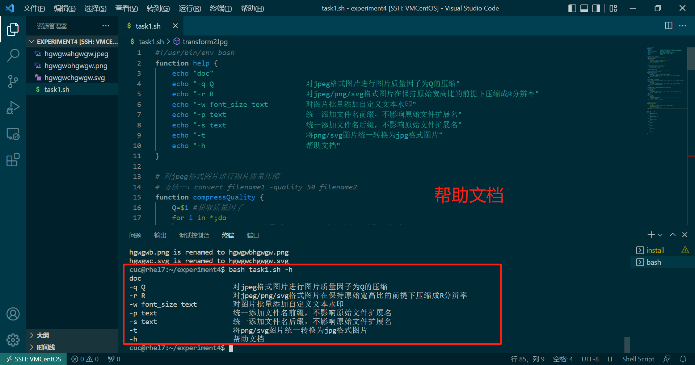

- 支持对jpeg格式图片进行图片质量压缩

```shell
# 方法一：
#convert filename1 -quality 50 filename2
function compressQuality {
    Q=$1 #质量因子
    for i in *;do
        type=${i##*.} #删除最后一个.及左边全部字符
        if [[ ${type} != "jpeg" ]];then continue;fi;
        convert "${i}" -quality "${Q}" "${i}"
        echo "${i} is compressed."
    done
}

# 方法二：直接用convert -resize压缩成100x100的图片
function compressQuality {
    convert -resize 100x100 a.jpeg  a-1.jpeg
    echo "a.jpeg已被压缩为a-1.jpeg"
}

compressQuality #调用函数
```
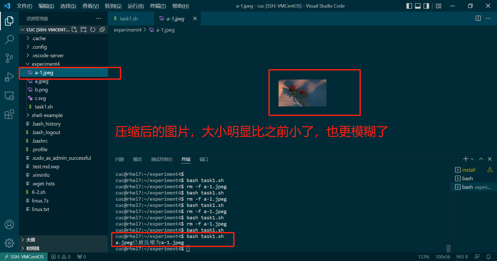

- 支持对jpeg/png/svg格式图片在保持原始宽高比的前提下压缩分辨率

```shell
# convert filename1 -resize R filename2
function compressResolusion {
    R=$1 #获取压缩分辨率
    for i in *;do
        type=${i##*.} #删除最后一个.及左边全部字符，获取文件后缀
        if [[ ${type} != "jpeg" && ${type} != "png" && ${type} != "cvg" ]];then continue;fi
        convert "${i}" -resize "${R}" "${i}"
        echo "${i} is resized."
    done
}
```

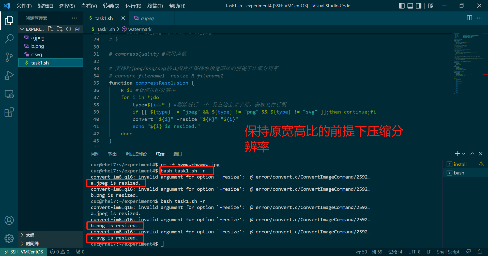

- 支持对图片批量添加自定义文本水印

```shell
# convert filename1 -pointsize 50 -fill green -gravity northeast -draw "text 10,10 'hgwgw'" filename2
function watermark {
    for i in *;do
        type=${i##*.}
        if [[ ${type} != "jpeg" && ${type} != "png" && ${type} != "cvg" ]];then continue;fi
        convert "${i}" -pointsize "$1" -fill green -gravity northeast -draw "text 10,10 '$2'" "${i}"
        echo "${i} is watermarked with $2."
    done
}
```

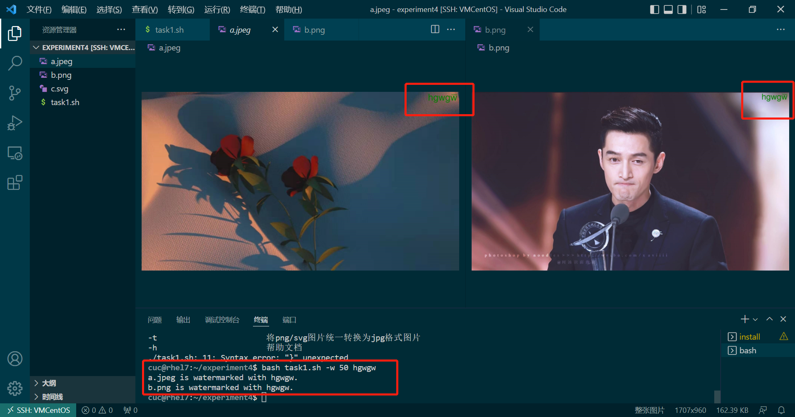

- 支持批量重命名（统一添加文件名前缀或后缀，不影响原始文件扩展名）

```shell
# mv filename1 filename2
function prefix {
    for i in *;do
        type=${i##*.}
        if [[ ${type} != "jpeg" && ${type} != "png" && ${type} != "svg" ]]; then continue; fi;
        mv "${i}" "$1""${i}"
        echo "${i} is renamed to $1${i}"
    done
}

function suffix {
    for i in *;do
        type=${i##*.}
        if [[ ${type} != "jpeg" && ${type} != "png" && ${type} != "svg" ]]; then continue; fi;
        filename=${i%.*}$1"."${type}
        mv "${i}" "${filename}"
        echo "${i} is renamed to ${filename}"
    done
}
```

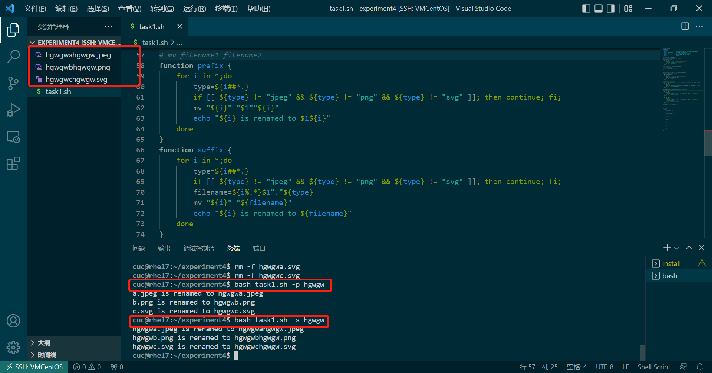

- 支持将png/svg图片统一转换为jpg格式图片

```shell
# convert xxx.png xxx.jpg
function transform2Jpg {
    for i in *;do
        type=${i##*.}
        if [[ ${type} != "jpeg" && ${type} != "png" && ${type} != "svg" ]]; then continue; fi;
        new_file=${i%%.*}".jpg"
        convert "${i}" "${new_file}"
        echo "${i} is transformed to jpg"
    done
}
```

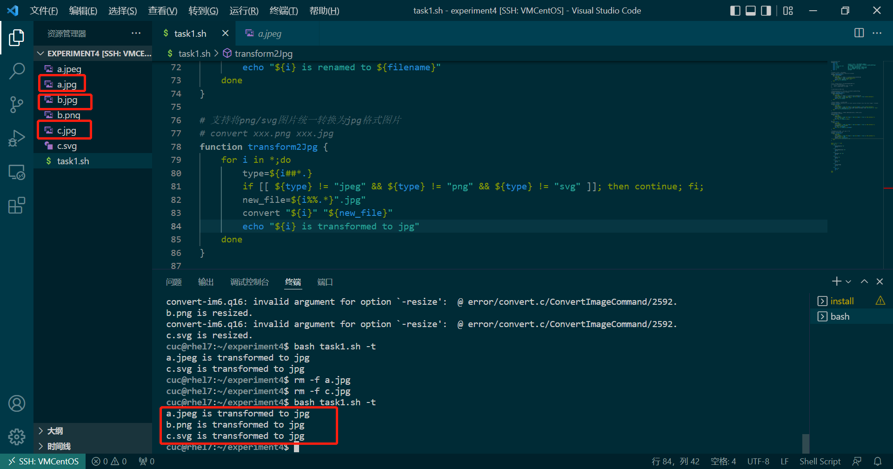

### 任务二：用bash编写一个文本批处理脚本，对以下附件分别进行批量处理完成相应的数据统计任务：

- 使用`wget`先将所需文件下载到本地

```shell
wget "https://c4pr1c3.gitee.io/linuxsysadmin/exp/chap0x04/worldcupplayerinfo.tsv"
```

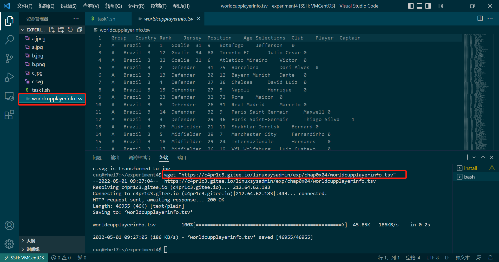

- 编写help函数，作为帮助文档（同任务一）
```shell
#!/usr/bin/env bash
function help {
    echo "doc"
    echo "-s    统计不同年龄区间范围（20岁以下、[20-30]、30岁以上）的球员数量、百分比"
    echo "-p    统计不同场上位置的球员数量、百分比"
    echo "-n    名字最长的球员是谁？名字最短的球员是谁？"
    echo "-a    年龄最大的球员是谁？年龄最小的球员是谁？"
    echo "-h    帮助文档"
}

while [ "$1" != "" ];do
case "$1" in
    "-a")
        Age "$2"
        exit 0
        ;;
    "-p")
        Position "$2"
        exit 0
        ;;
    "-n")
        Name "$2" 
        exit 0
        ;;
    "-m")
        MaxMin "$2"
        exit 0
        ;;
    "-h")
        help "$2"
        exit 0
        ;;
esac
done
```

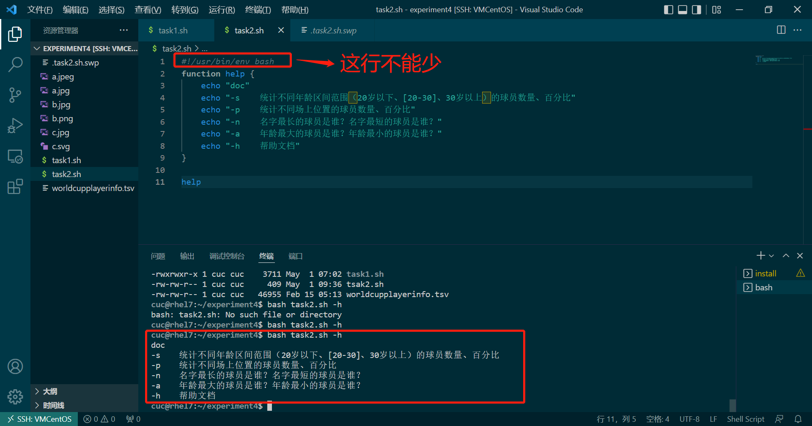

- 分析文档，找出需要的列

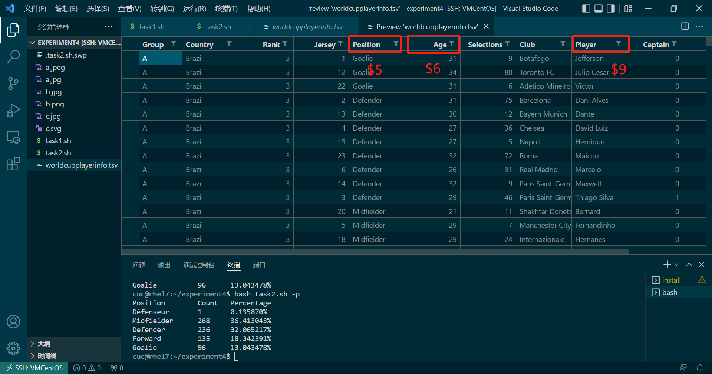

- 统计不同年龄区间范围（20岁以下、[20-30]、30岁以上）的球员数量、百分比

```shell
function Age {
    awk -F "\t" '
        BEGIN {a=0; b=0; c=0;}
        $6!="Age" {
            if($6>=0 && $6<20) {
                a++;
            }
            else if($6<=30){
                b++;
            }
            else{
                c++;
            }
        }
        END {
            sum=a+b+c;
            printf("Age\tCount\tPercentage\n");
            printf("<20\t%d\t%f%%\n",a,a*100.0/sum);
            printf("[20,30]\t%d\t%f%%\n",b,b*100.0/sum);
            printf(">30\t%d\t%f%%\n",c,c*100.0/sum);
        }' worldcupplayerinfo.tsv
}
```

- 统计不同场上位置的球员数量、百分比

```shell
function Position {
    awk -F "\t" '
        BEGIN {sum=0;}
        $5!="Position" {
            pos[$5]++;
            sum++;
        }
        END {
            printf("Position\tCount\tPercentage\n");
            for(i in pos) {
                printf("%-10s\t%d\t%f%%\n",i,pos[i],pos[i]*100.0/sum);
            }
        }' worldcupplayerinfo.tsv
}
```

- 名字最长的球员是谁？名字最短的球员是谁？

```shell
function Name {
    awk -F "\t" '
        BEGIN {max=-1;min=1000;}
        $9!="Player" {
            len=length($9);
            name[$9]=len;
            max=len>max?len:max;
            min=len<min?len:min;
        }
        END {
            for(i in name) {
                if(name[i]==max){
                    printf("The player with the longest name is %s\n",i);
                }
                else if(name[i]==min){
                    printf("The player with the shortest name is %s\n",i);
                }
            }
        }' worldcupplayerinfo.tsv
}
```

- 年龄最大的球员是谁？年龄最小的球员是谁？

```shell
function MaxMin {
    awk -F "\t" '
        BEGIN {max=-1;min=1000;}
        $6!="Age" {
            age=$6;
            name[$9]=age;
            max=age>max?age:max;
            min=age<min?age:min;
        }
        END {
            for(i in name){
                if(name[i]==max){
                    printf("The oldest player is %s,his age is %d\n",i,max);
                }
                else if(name[i]==min){
                    printf("The youngest player is %s,his age is %d\n",i,min);
                }
            }
        }' worldcupplayerinfo.tsv
}
```

- 实验结果

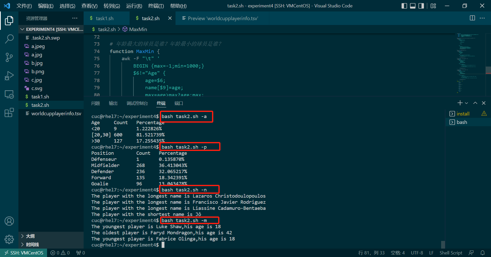

### 任务三：用bash编写一个文本批处理脚本，对以下附件分别进行批量处理完成相应的数据统计任务：

- 提前安装`p7zip-full`

```shell
sudo apt-get install p7zip-full
```

- 将所需文件下载到本地并解压

```shell
wget "https://c4pr1c3.github.io/LinuxSysAdmin/exp/chap0x04/web_log.tsv.7z"
7z x web_log.tsv.7z
```

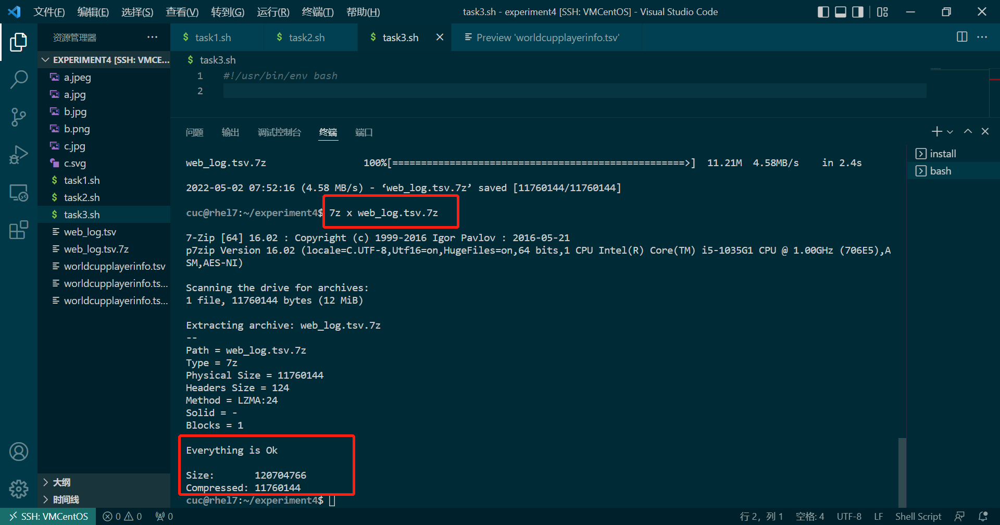

- 编写help函数

```shell
#!/usr/bin/env bash
function help {
    echo "doc"
    echo "-o        统计访问来源主机TOP 100和分别对应出现的总次数"
    echo "-i        统计访问来源主机TOP 100 IP和分别对应出现的总次数"
    echo "-u        统计最频繁被访问的URL TOP 100"
    echo "-r        统计不同响应状态码的出现次数和对应百分比"
    echo "-f        分别统计不同4XX状态码对应的TOP 10 URL和对应出现的总次数"
    echo "-s URL    给定URL输出TOP 100访问来源主机"
    echo "-h        帮助文档"
}

while [ "$1" != "" ];do
case "$1" in
    "-o")
        top100_host "$2"
        exit 0
        ;;
    "-i")
        top100_ip "$2"
        exit 0
        ;;
    "-u")
        top100_url "$2" 
        exit 0
        ;;
    "-r")
        response "$2"
        exit 0
        ;;
    "-f")
        4xxresponse "$2"
        exit 0
        ;;
    "-s")
        top100_source "$2"
        exit 0
        ;;        
    "-h")
        help "$2"
        exit 0
        ;;
esac
done
```

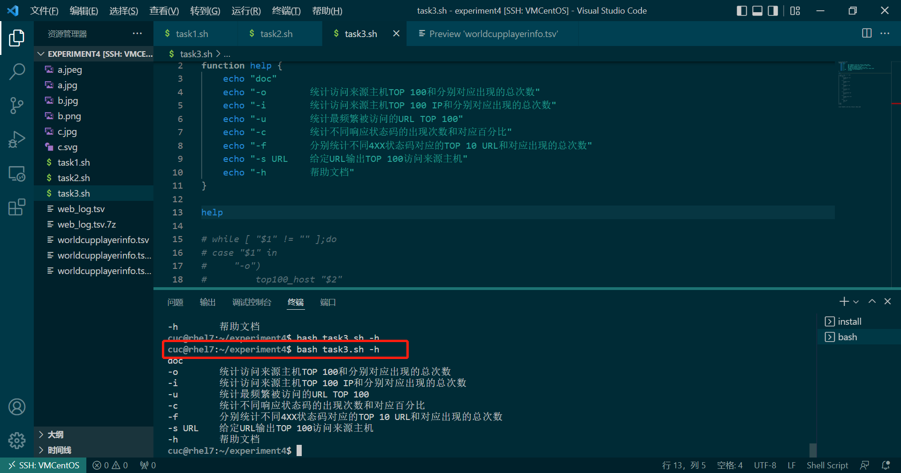

- 统计访问来源主机TOP 100和分别对应出现的总次数

```shell
function top100_host {
    printf "%40s\t%s\n" "top100_host" "count"
    awk -F "\t" '
    NR>1 {
        host[$1]++;
    }
    END {
        for(i in host){
            printf("%40s\t%d\n",i,host[i]);
        }
    }' web_log.tsv | sort -g -k 2 -r | head -100
}
```

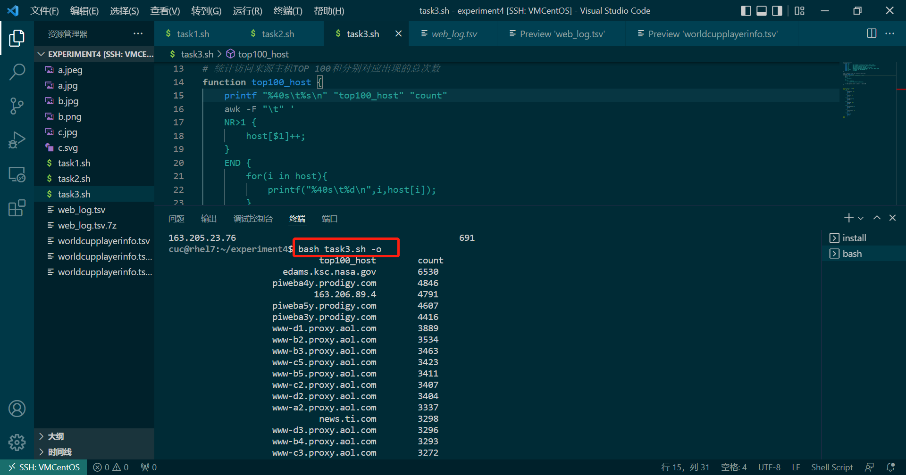

- 统计访问来源主机TOP 100 IP和分别对应出现的总次数

```shell
function top100_ip {
    printf "%20s\t%s\n" "top100_ip" "count"
    awk -F "\t" '
    NR>1 {
        if(match($1,/^[0-9]{1,3}\.[0-9]{1,3}\.[0-9]{1,3}\.[0-9]{1,3}$/)){
            ip[$1]++;
        }
    }
    END {
        for(i in ip){
            printf("%20s\t%d\n",i,ip[i]);
        }
    }' web_log.tsv | sort -g -k 2 -r | head -100
}
```

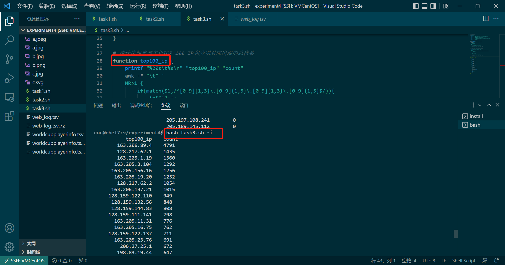

- 统计最频繁被访问的URL TOP 100

```shell
function top100_url {
    printf "%55s\t%s\n" "top100_url" "count"
    awk -F "\t" '
    NR>1 {
        url[$5]++;
    }
    END {
        for(i in url){
            printf("%55s\t%d\n",i,url[i]);
        }
    }' web_log.tsv | sort -g -k 2 -r | head -100
}
```

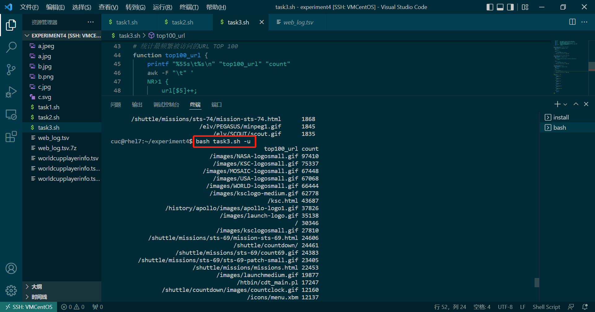

- 统计不同响应状态码的出现次数和对应百分比

```shell
function response {
    awk -F "\t" '
    BEGIN {
        printf("response\tcount\tpercentage\n");
    }
    NR>1 {
        response[$6]++;
    }
    END {
        for(i in response){
            printf("%d\t%d\t%f%%\n",i,response[i],response[i]*100/(NR-1));
        }
    }' web_log.tsv
}
```

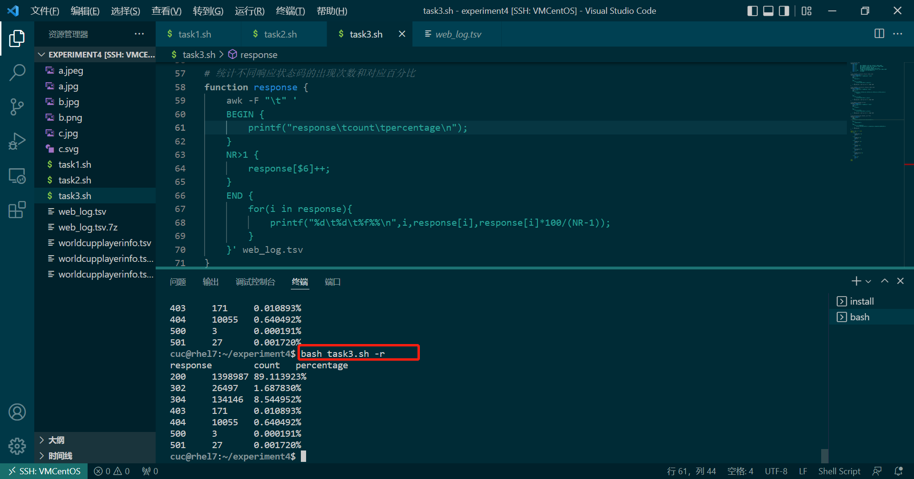

- 分别统计不同4XX状态码对应的TOP 10 URL和对应出现的总次数

```shell
function 4xxresponse {
    printf "%70s\t%s\n" "code=403 url" "count"
    awk -F "\t" '
    NR>1 {
        if($6==403) {
            url[$5]++;
        }
    }
    END {
        for(i in url) {
            printf("%70s\t%d\n",i,url[i]);
        }
    }' web_log.tsv | sort -g -k 2 -r | head -100

    printf "%70s\t%s\n" "code=404 url" "count"
    awk -F "\t" '
    NR>1 {
        if($6==404) {
            url[$5]++;
        }
    }
    END {
        for(i in url) {
            printf("%70s\t%d\n",i,url[i]);
        }
    }' web_log.tsv | sort -g -k 2 -r | head -100
}
```

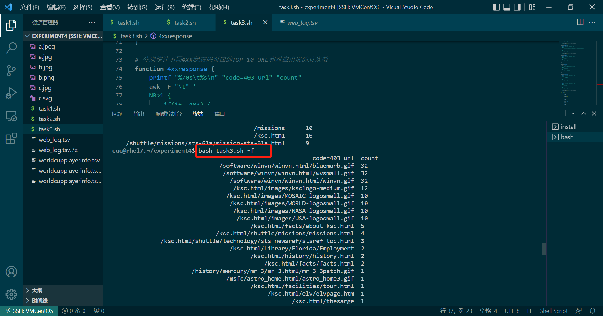

- 给定URL输出TOP 100访问来源主机

```shell
function top100_source {
    printf "%30s\t%10s\n" "top100_source" "count"
    awk -F "\t" '
    NR>1 {
        if("'"$1"'"==$5) {
            host[$1]++;
        }
    }
    END {
        for(i in host){
            printf("%30s\t%d\n",i,host[i]);
        }
    }' web_log.tsv | sort -g -k 2 -r | head -100
}
```

以`/images/ksclogo-medium.gif`为例：

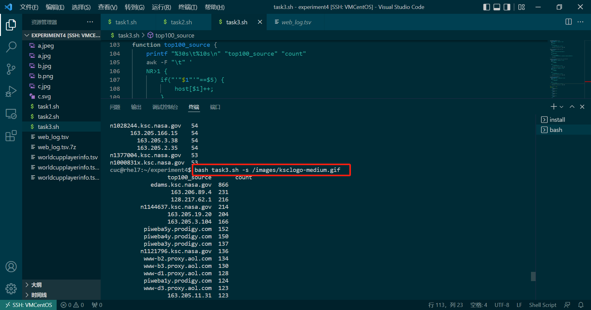

## 实验中遇到的问题

> 问题1

- 定义了help函数，里面写了帮助文档，但是一直没有输出

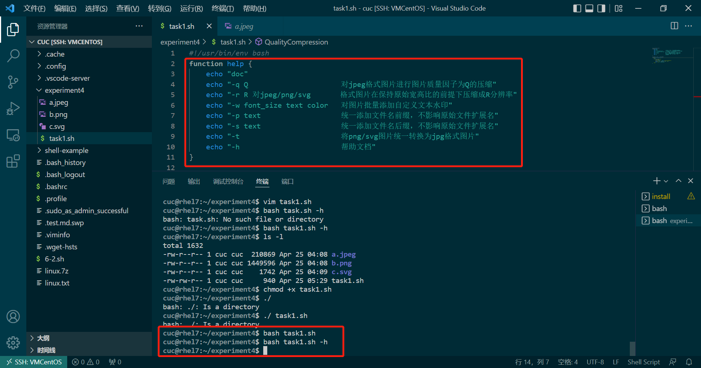

- 错误原因：没有调用函数
- 解决方法：在函数的后面写上`help`,即调用help函数

> 问题2

- 单独写`task3`的实验数据,列表格的时候，要一个一个地敲`|`，很麻烦，而且我好不容易敲完了，又很乱，怕上传到GitHub又乱码，所以参考了邓一凡同学的方法，既简便又整齐

- 以`统计访问来源主机TOP 100和分别对应出现的总次数`为例：
  - 首先，将数据输出到`t3_1.txt`文件中 
    ```shell
    bash task3.sh -o > t3_1.txt
    ```
  - 然后，使用`awk`在第一列和第二列前后添加`|`，并且重定向到t_1.txt中，就有了表格式的输出数据
    ```shell
    awk -F' ' '{print "| " $1 " | " $2 " |"}' t3_1.txt > t_1.txt
    ```

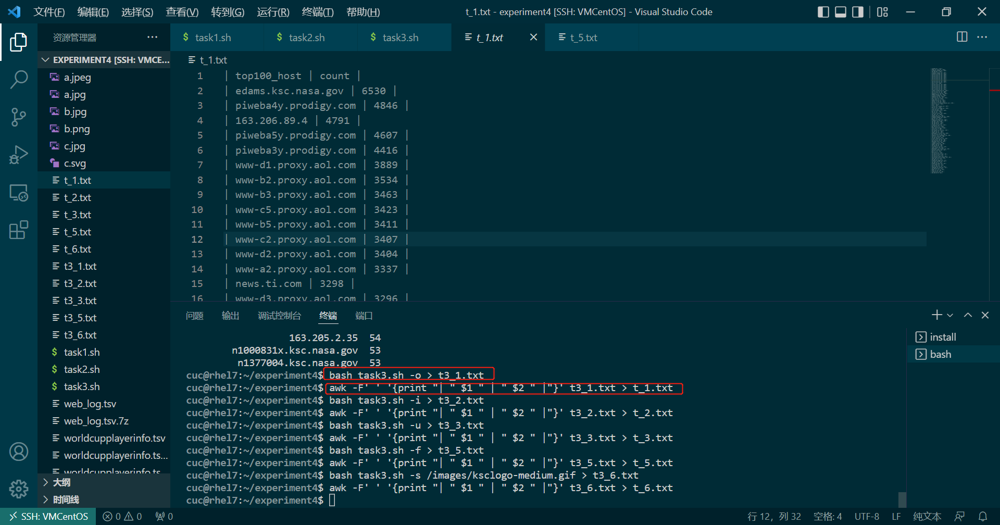

## 参考资料

- [vscode连接虚拟机](https://www.cnblogs.com/hi3254014978/p/12681594.html)
- [CUCCS/linux-2020-LyuLumos](https://github.com/CUCCS/linux-2020-LyuLumos/blob/ch0x04/ch0x04/)
- [shell获取文件扩展名](https://blog.csdn.net/RonnyJiang/article/details/52386121)
- [ImageMagick官方文档](https://imagemagick.org/)
- [Linux awk 命令](https://www.runoob.com/linux/linux-comm-awk.html)
- [Linux awk命令详解](http://c.biancheng.net/view/4082.html)
- [Linux sort 命令](https://www.runoob.com/linux/linux-comm-sort.html)
- [2022-linux-public-Lime-Cocoa](https://github.com/CUCCS/2022-linux-public-Lime-Cocoa/blob/chap0x04/chap0x04/README.md)