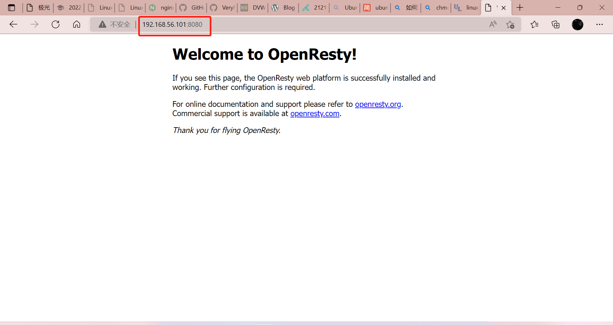
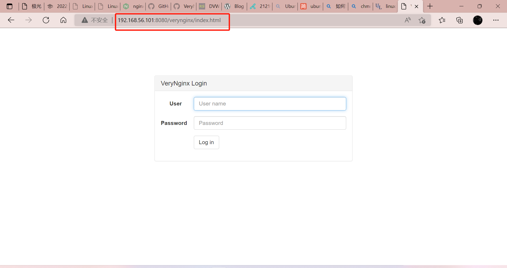
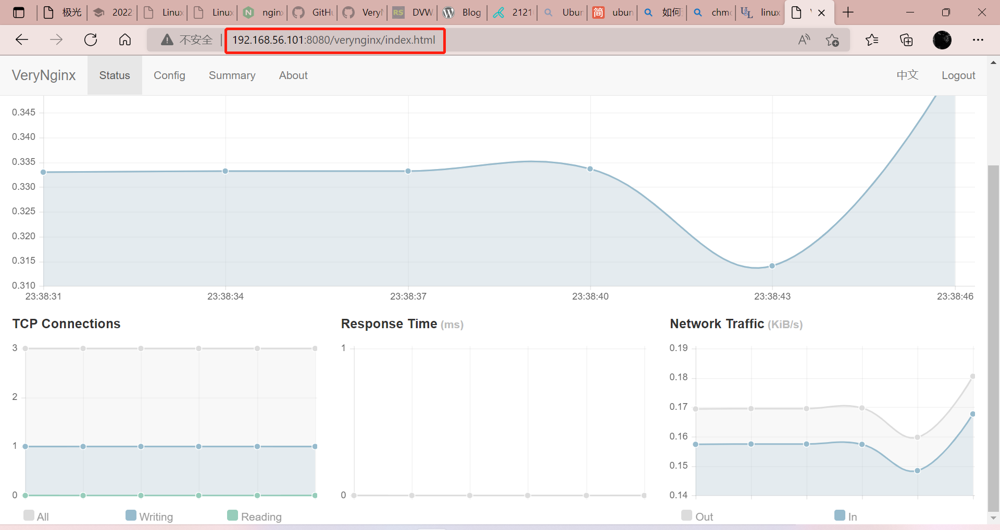
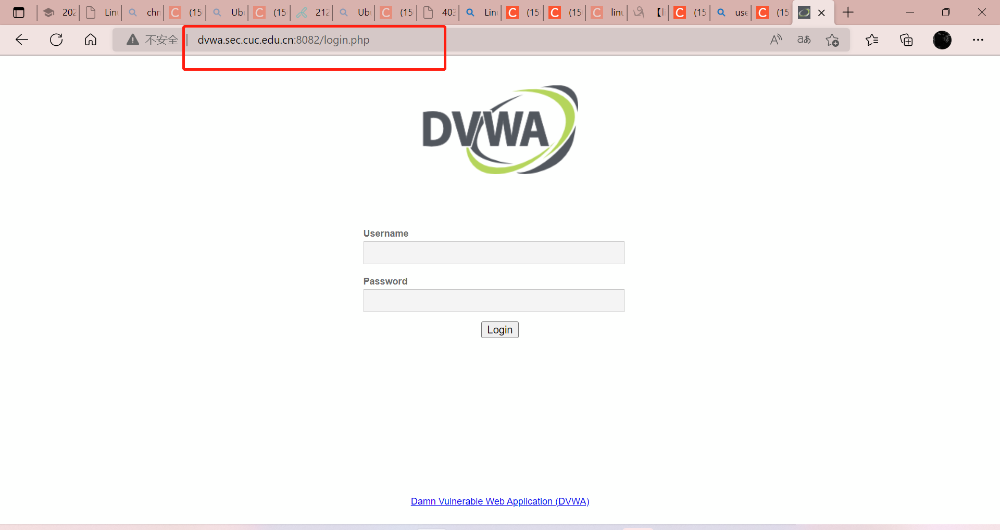
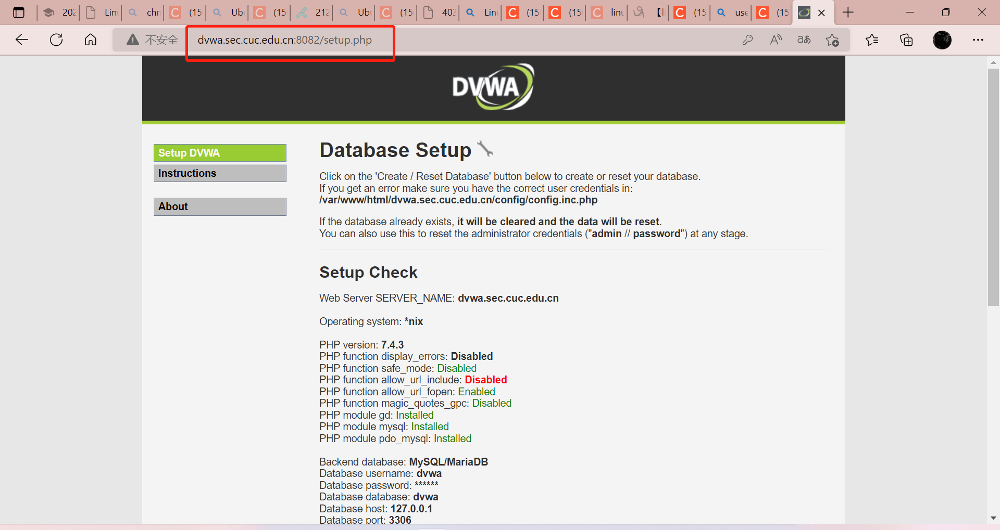

# Linux实验五：WEB服务器

### 实验环境

- VirtualBox
- Ubuntu 20.04 Server 64bit
- 软件环境
  - Nginx
  - VeryNginx
  - WordCompress4.7
  - DVWA

## 实验内容

#### 基本要求

- 在一台主机（虚拟机）上同时配置Nginx和VeryNginx
  - VeryNginx作为本次实验的Web App的反向代理服务器和WAF
  - PHP-FPM进程的反向代理配置在nginx服务器上，VeryNginx服务器不直接配置Web站点服务
- 使用[Wordpress](https://wordpress.org/)搭建的站点对外提供访问的地址为： http://wp.sec.cuc.edu.cn
- 使用[Damn Vulnerable Web Application (DVWA)](https://dvwa.co.uk/)搭建的站点对外提供访问的地址为： http://dvwa.sec.cuc.edu.cn

#### 安全加固要求

- 使用IP地址方式均无法访问上述任意站点，并向访客展示自定义的**友好错误提示信息页面-1**
- [Damn Vulnerable Web Application (DVWA)](https://dvwa.co.uk/)只允许白名单上的访客来源IP，其他来源的IP访问均向访客展示自定义的友好错误提示信息页面-2
- 在不升级Wordpress版本的情况下，通过定制[VeryNginx](https://github.com/alexazhou/VeryNginx)的访问控制策略规则，**热**修复[WordPress < 4.7.1 - Username Enumeration](https://www.exploit-db.com/exploits/41497/)
- 通过配置[VeryNginx](https://github.com/alexazhou/VeryNginx)的Filter规则实现对[Damn Vulnerable Web Application (DVWA)](https://dvwa.co.uk/)的SQL注入实验在低安全等级条件下进行防护

#### VeryNginx配置要求

- [VeryNginx](https://github.com/alexazhou/VeryNginx)的Web管理页面仅允许白名单上的访客来源IP，其他来源的IP访问均向访客展示自定义的友好错误提示信息页面-3
- 通过定制[VeryNginx](https://github.com/alexazhou/VeryNginx)的访问控制策略规则实现：
  - 限制DVWA站点的单IP访问速率为每秒请求数 < 50
  - 限制Wordpress站点的单IP访问速率为每秒请求数 < 20
  - 超过访问频率限制的请求直接返回自定义错误提示信息页面-4
  - 禁止curl访问

## 实验过程

#### 一. 环境搭建

**1. 修改宿主机的`hosts`文件**

hosts文件路径如下：`C:\Windows\System32\drivers\etc`

```shell
# nginx
192.168.56.101 vn.sec.cuc.edu.cn
192.168.56.101 dvwa.sec.cuc.edu.cn
192.168.56.101 wp.sec.cuc.edu.cn
```

**2. 安装配置 `VeryNginx`**

- 首先，克隆 `VeryNginx` 仓库
  
```shell
git clone https://github.com/alexazhou/VeryNginx.git
```

- 然后，安装依赖

```shell
sudo apt update
sudo apt install gcc
sudo apt install make
sudo apt install libpcre3 libpcre3-dev zlib1g zlib1g-dev libssl-dev
```

- 进入`VeryNginx`目录，进行安装

```shell
#进入VeryNginx目录
cd VeryNginx
#安装VeryNginx
sudo python3 install.py install
```

- 修改 `/opt/verynginx/openresty/nginx/conf/nginx.conf` 配置文件

```shell
# 打开配置文件
sudo vim /opt/verynginx/openresty/nginx/conf/nginx.conf

# 修改以下内容：

# 修改用户名，将user从nginx改为www-data
user  www-data
# 将监听地址改为host-only网卡的地址，为避免冲突，将监听端口改为8080
server {
        listen 192.168.56.101:8080;
        
        #this line shoud be include in every server block
        include /opt/verynginx/verynginx/nginx_conf/in_server_block.conf;

        location = / {
            root   html;
            index  index.html index.htm;
        }
    }
```

- 添加Nginx进程的权限

```
chmod -R 777 /opt/verynginx/verynginx/configs
```

- 启动VeryNginx

```shell
sudo /opt/verynginx/openresty/nginx/sbin/nginx
```

- 在主机访问8080端口，可以访问VeryNginx初始页面



- 输入`http://192.168.56.101:8080/verynginx/index.html`，用户名和密码都是 `verynginx` ，成功进入后台管理页面





- 相关服务需要用到的命令（有时需要sudo）

```shell
#启动服务
/opt/verynginx/openresty/nginx/sbin/nginx

#停止服务
/opt/verynginx/openresty/nginx/sbin/nginx -s stop

#重启服务
/opt/verynginx/openresty/nginx/sbin/nginx -s reload
```

**3. 安装配置 `Nginx`**

- 安装`php`及其相关组件
```
sudo apt install php-fpm php-mysql php-curl php-gd php-intl php-mbstring php-soap php-xml php-xmlrpc php-zip
```

- 安装`mysql`
```
sudo apt install mysql-server
```

- 安装`Nginx`

```shell
sudo apt update
sudo apt install nginx
```

- 修改`Nginx`的相关配置文件
  
```
sudo vim /etc/nginx/sites-enabled/default
```

- 修改内容如下

```
server {
        listen 192.168.56.101:80 default_server;
        listen [::]:80 default_server;

        root /var/www/html;

        index index.html index.htm index.nginx-debian.html index.php;

        server_name _;

        location / {
               
                try_files $uri $uri/ =404;
        }


        location ~ \.php$ {
                include snippets/fastcgi-php.conf;
       
                fastcgi_pass unix:/var/run/php/php7.4-fpm.sock;

        }

        location ~ /\.ht {
                deny all;
        }
}
```

- 查看服务状态，确定`Nginx`是否正常启动

```shell
sudo systemctl status nginx
```

输出将如下所示：

```shell
● nginx.service - A high performance web server and a reverse proxy server
     Loaded: loaded (/lib/systemd/system/nginx.service; enabled; vendor preset:>
     Active: active (running) since Sun 2022-06-05 22:23:13 EDT; 24min ago
       Docs: man:nginx(8)
    Process: 645 ExecStartPre=/usr/sbin/nginx -t -q -g daemon on; master_proces>
    Process: 722 ExecStart=/usr/sbin/nginx -g daemon on; master_process on; (co>
   Main PID: 728 (nginx)
      Tasks: 2 (limit: 1067)
     Memory: 8.0M
     CGroup: /system.slice/nginx.service
             ├─728 nginx: master process /usr/sbin/nginx -g daemon on; master_p>
             └─729 nginx: worker process

```

**4. 安装配置`Wordpress`**                                    

- 首先下载并解压缩

```shell
# 下载安装包
sudo wget https://wordpress.org/wordpress-4.7.zip

# 解压
sudo apt install p7zip-full
7z x wordpress-4.7.zip
```

- 将解压后的wordpress移至指定路径

```shell
sudo mkdir -p /var/www/html/wp.sec.cuc.edu.cn
sudo cp -r wordpress /var/www/html/wp.sec.cuc.edu.cn
```

- 在MySQL中新建一个数据库用于wordpress

```shell
# 下载安装mysql数据库
sudo apt install mysql-server
# 登陆
sudo mysql
# 新建一个数据库wordpress
CREATE DATABASE wordpress DEFAULT CHARACTER SET utf8 COLLATE utf8_unicode_ci;
# 新建用户
create user 'hgwgw'@'localhost' identified by '123456';
# 授权
grant all on wordpress.* to 'hgwgw'@'localhost';
# 刷新并退出
FLUSH PRIVILEGES;
EXIT;
```

- 设置wordpress配置文件
  - 从wordpress密钥生成器中获取安全值，输入以下命令

```shell
curl -s https://api.wordpress.org/secret-key/1.1/salt/
```

输出内容如下：
```shell
define('AUTH_KEY',         'O9*P%)l-fi5knlYxa/+dmon>-3O~kFZC+ore0F-{;;;|z}2wu-w-0J }V#vDBh8>');
define('SECURE_AUTH_KEY',  'PmPh#qwQTnmSjO*MB=-tE4nV~~]E2*l8q3;2KyF,}5Ex+lnM0Ka|-pqIwXc+./+a');
define('LOGGED_IN_KEY',    'T#@BDH^dGxB=y.VGbD%ECl@Z`]aOQB_N~CO)$Rw0vNzn]$dj9M8-.;.H */Q+*6C');
define('NONCE_KEY',        '%lAcT|RyH|jd6Q|sd%AVw6G|3pxr.ih:H-z&nBGwCB~:M1Xk`2pdcR(1]Xpgmm[o');
define('AUTH_SALT',        'nzI;}|rSox8:Td4o(+fmTog}.e<g8I<0IPffzVaA2Q<h,reN@{w6x}zvJwm/L]-W');
define('SECURE_AUTH_SALT', 'k&#d=|)`KFwWk}(!?=C:1&Cac(f/c~@|d(N[jmODuoW3z]_*;.zy1v;<Cs|jn<Xz');
define('LOGGED_IN_SALT',   'h3bQ|BY(Lju;uoVG5V|Plvrw9_u[>k;w8O0Z;zLyj&CX]B@m#F.a$bkr1HZ67#G!');
define('NONCE_SALT',       '~][I3o-<J)Z}rs&%|teHoA{)n?#,v~B&?-S_wI=sW0vI+GT@Z|K+@L@yf)cPa1 @');

```

这些是配置行，可以直接粘贴到配置文件中以设置安全密钥。复制收到的输出。

- 打开wordpress配置文件并修改

```shell
# 打开配置文件wp-config.php
cd /var/www/html/wp.sec.cuc.edu.cn/wordpress
sudo vim wp-config-sample.php
# 修改内容如下：
// ** MySQL settings - You can get this info from your web host ** //
/** The name of the database for WordPress */
define('DB_NAME', 'wordpress');

/** MySQL database username */
define('DB_USER', 'hgwgw');

/** MySQL database password */
define('DB_PASSWORD', '123456');

/** MySQL hostname */
define('DB_HOST', 'localhost');

/** Database Charset to use in creating database tables. */
define('DB_CHARSET', 'utf8');

/** The Database Collate type. Don't change this if in doubt. */
define('DB_COLLATE', '');
```

- 配置Nginx

```shell
# 配置Nginx
sudo vim /etc/nginx/sites-available/wp.sec.cuc.edu.cn
# 配置文件如下
server {
    listen 192.168.56.101:8888;
    server_name wp.sec.cuc.edu.cn  www.wp.sec.cuc.edu.cn;
    root /var/www/html/wp.sec.cuc.edu.cn;

    index index.html index.htm index.php;

    location ~ \.php$ {
        include snippets/fastcgi-php.conf;
        fastcgi_pass unix:/var/run/php/php7.4-fpm.sock;
     }
    location = /favicon.ico { log_not_found off; access_log off; }
    location = /robots.txt { log_not_found off; access_log off; allow all; }
    location ~* \.(css|gif|ico|jpeg|jpg|js|png)$ {
        expires max;
        log_not_found off;
    }
    location ~ /\.ht {
        deny all;
    }
     location / {
        #try_files $uri $uri/ =404;
        try_files $uri $uri/ /index.php$is_args$args;
    }
}
```

- 建立软链接并启动nginx

```shell
# 建立软链接
sudo ln -s /etc/nginx/sites-available/wp.sec.cuc.edu.cn /etc/nginx/sites-enabled/
# 语法检查
sudo nginx -t
# 启动nginx
sudo systemctl restart nginx.service
```

然后访问`http://192.168.56.101:8888/wp-admin/`即可进入控制台（按理来说，但是我恢复备份之后有些乱套了，这里wordpress显示有些异常）

**5. `DVWA`搭建网站**

- 下载安装

```
# 下载DVWA
git clone https://github.com/digininja/DVWA.git
# 建立目录
sudo mkdir /var/www/html/dvwa.sec.cuc.edu.cn
# 把文件夹里面的内容移动到目录下
sudo mv DVWA/* /var/www/html/dvwa.sec.cuc.edu.cn
```

- 创建数据库和供DVWA使用的用户
  
```
配置MySQL
```bash
sudo mysql
# 下面的内容是mysql语句
mysql> create database dvwa;
Query OK, 1 row affected (0.01 sec)

mysql> create user dvwa@localhost identified by 'p@ssw0rd';
Query OK, 0 rows affected (0.02 sec)

mysql> grant all on dvwa.* to dvwa@localhost;
Query OK, 0 rows affected (0.00 sec)

mysql> flush privileges;
Query OK, 0 rows affected (0.02 sec)

mysql> exit
Bye
```

- 设置DVWA与PHP等相关环境

```
# 重命名
cd /var/www/html/dvwa.sec.cuc.edu.cn/config/
sudo cp config.inc.php.dist config.inc.php

# 修改配置
sudo vim /var/www/html/DVWA/config/config.inc.php
## 根据数据库对应修改配置
$_DVWA[ 'db_database' ] = 'dvwa';
$_DVWA[ 'db_user' ]     = 'dvwa';
$_DVWA[ 'db_password' ] = 'p@ssw0rd';
##

# 修改php配置
sudo vim /etc/php/7.4/fpm/php.ini 

## 设置以下内容
allow_url_include = on
##

#重启php
sudo systemctl restart php7.4-fpm
#将所有权分配给www-data用户和组
sudo chown -R www-data.www-data /var/www/html/dvwa.sec.cuc.edu.cn
```

- 配置`Nginx`

```
# 进入配置
sudo vim /etc/nginx/sites-available/dvwa.sec.cuc.edu.cn
# 配置文件如下
server {
    listen 8082 default_server;
    listen [::]:8082 default_server;

    root /var/www/html/dvwa.sec.cuc.edu.cn;
    index index.php index.html index.htm index.nginx-debian.html;
    server_name dvwa.sec.cuc.edu.cn;

    location / {
        #try_files $uri $uri/ =404;
        try_files $uri $uri/ /index.php$is_args$args;
    }

    location ~ \.php$ {
        include snippets/fastcgi-php.conf;
        fastcgi_pass unix:/var/run/php/php7.4-fpm.sock;
    }

    location ~ /\.ht {
        deny all;
    }
}
```

- 建立软链接并启动nginx

```shell
# 建立软链接
sudo ln -s /etc/nginx/sites-available/dvwa.sec.cuc.edu.cn /etc/nginx/sites-enabled/
# 语法检查
sudo nginx -t
# 启动nginx
sudo systemctl restart nginx.service
```

- 访问`http://dvwa.sec.cuc.edu.cn:8082`，可进入登陆页面



- 输入用户名`dvwa`和密码`p@ssw0rd`，即可进入DVWA




## 实验中遇到的问题

> 问题1

- 问题：配置完Nginx之后，不能正常访问Nginx初始页面
  - 我安装Nginx之后，修改了配置文件，但是应该哪里修改错误了，找到其中一处就是少了一个 `}`，加上之后还是不可以，没有找到其他错误，又忘记了最开始没有修改时候的配置文件是什么样子的，不能对比，最终没能找到错误
    - 修改`Nginx`相关配置文件
        ```shell
        sudo vim /etc/nginx/sites-enabled/default
        ```
    - 修改后如下：

        ```shell
        server {
                listen 192.168.56.101:80 default_server;
                listen [::]:80 default_server;

                root /var/www/html;
                # Add index.php to the list if you are using PHP
                index index.html index.htm index.nginx-debian.html;

                server_name _;

                location / {
                        try_files $uri $uri/ =404;
                }

                location ~ \.php$ {
                        include snippets/fastcgi-php.conf;

                #       # With php-fpm (or other unix sockets):
                        fastcgi_pass unix:/var/run/php/php7.4-fpm.sock;
                #       # With php-cgi (or other tcp sockets):
                #       fastcgi_pass 127.0.0.1:9000;
                #}

                # deny access to .htaccess files, if Apache's document root
                # concurs with nginx's one
                location ~ /\.ht {
                        deny all;
                }        
        ```
- 解决方式：卸载重装Nginx

```shell
#1.删除nginx，-purge包括配置文件
sudo apt-get --purge remove nginx

#2.卸载自动安装且不再需要的（不被其他软件当作依赖的）软件包
sudo apt-get autoremove

#3.罗列出与nginx相关的软件并删除
dpkg --get-selections|grep nginx
#卸载nginx不保留配置文件
sudo apt-get --purge remove nginx
#卸载nginx-common不保留配置文件
sudo apt-get --purge remove nginx-common
sudo apt-get --purge remove nginx-core

#4.列出与nginx有关的进程信，如果有就kill掉
ps -ef | grep nginx
sudo kill -9 XXX

#5.全局查找与nginx相关的文件
sudo  find  /  -name  nginx*
# 我显示的都是VeryNginx的东西，所以没有kill任何
sudo rm -rf file

#6.删除列出的所有文件
sudo rm -rf file

#7.重装nginx
sudo apt-get update
sudo apt-get install nginx
```

> 问题2

- 问题：在MySQL中新建一个数据库用于wordpress时，不能创建用户，总是提示设置的密码有问题
  - 最开始的报错：
  ```shell
  ERROR 1819 (HY000): Your password does not satisfy the current policy requirements
  ```
  - 后来又一个报错：
  ```shell
  ERROR 1193 (HY000): Unknown system variable 'validate_password_length'
  ```

原因是因为密码设置的过于简单会报错,MySQL有密码设置的规范，具体是与validate_password_policy的值有关

- 解决方法：
```shell
# 查看MYSQL完整的初始密码规则
SHOW VARIABLES LIKE 'validate_password%';
# 输出结果如下：
+--------------------------------------+--------+
| Variable_name                        | Value  |
+--------------------------------------+--------+
| validate_password.check_user_name    | ON     |
| validate_password.dictionary_file    |        |
| validate_password.length             | 8      |
| validate_password.mixed_case_count   | 1      |
| validate_password.number_count       | 1      |
| validate_password.policy             | MEDIUM |
| validate_password.special_char_count | 1      |
+--------------------------------------+--------+
7 rows in set (0.02 sec)

# 实际解决
# 首先，进入启动MySQL
mysql> mysql.server start
    -> Starting MySQL
    -> mysql -uroot
# 在MySQL中输入如下命令
set global validate_password.policy=0;
set global validate_password.length=1;
# 再重新创建用户并设置密码
create user 'hgwgw'@'localhost' identified by '123456';
```

> 问题3

- 问题：访问wordpress时出现以下报错：

```shell
dial tcp 192.168.43.3:80: connectex: A connection attempt failed because the connected party did not properly respond after a period of time, or established connection failed because connected host has failed to respond.
```

- 解决方式：
  
```shell
# 查看GOSUMDB的配置
go env
# 关掉GOSUMDB
go env -w GOSUMDB=off
# 代理推荐
go env -w GOPROXY=https://goproxy.cn,direct
```

然后就可以正常访问了

## 参考资料

- [ubuntu20.04安装VeryNginx](https://www.jianshu.com/p/6c9c38898b48)
- [How To Install Nginx on Ubuntu 20.04](https://www.digitalocean.com/community/tutorials/how-to-install-nginx-on-ubuntu-20-04)
- [ubuntu20.04 彻底卸载apache2安装nginx](https://codeleading.com/article/19085318094/)
- [mysql8.0设置密码报错：ERROR 1193 (HY000): Unknown system variable](https://blog.csdn.net/weixin_44425934/article/details/109047655)
- [Ubuntu Server 20.04 安装WordPress](https://zhuanlan.zhihu.com/p/445191504)
- [How to Install WordPress with LEMP on Ubuntu 20.04](https://www.digitalocean.com/community/tutorials/how-to-install-wordpress-with-lemp-on-ubuntu-20-04)
- [CUCCS/linux-2020-LyuLumos](https://github.com/CUCCS/linux-2020-LyuLumos/blob/ch0x05/ch0x05/%E7%AC%AC%E4%BA%94%E6%AC%A1%E5%AE%9E%E9%AA%8C%E6%8A%A5%E5%91%8A.md#nginx)


